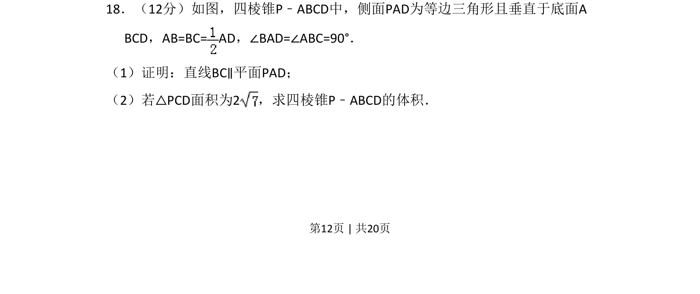
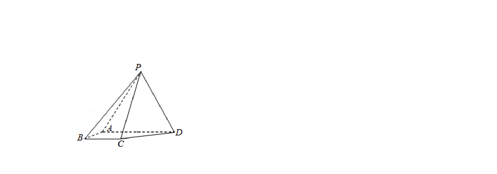
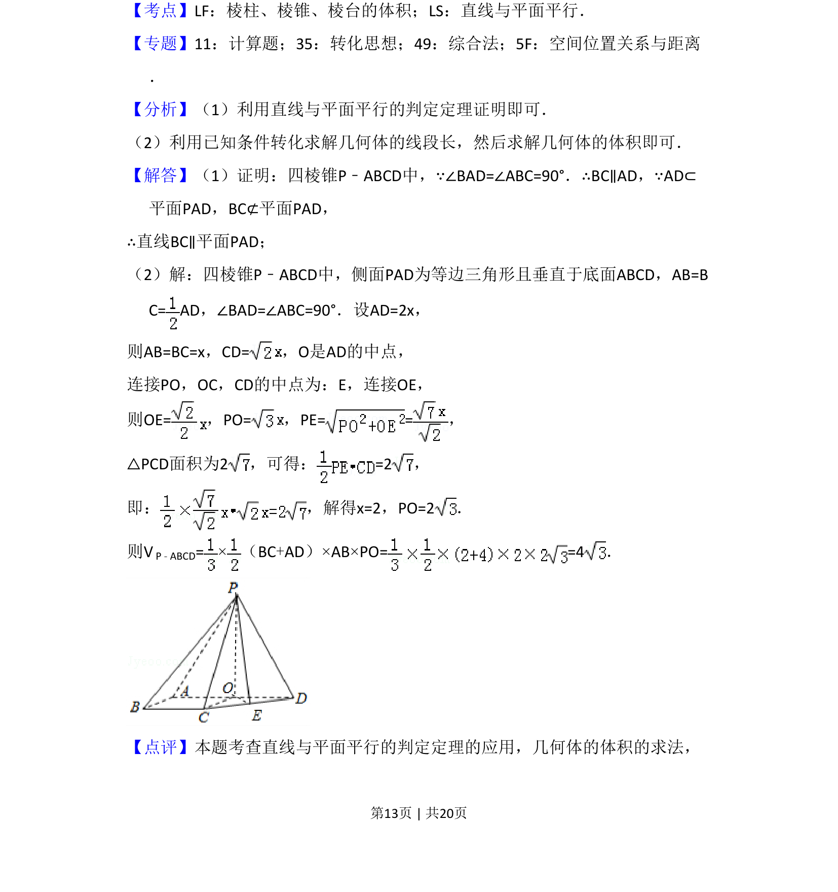
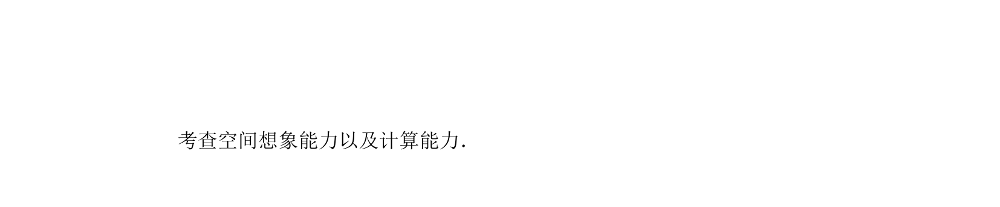

## 题面

## 摘要

四棱锥中证明线面平行，利用面面垂直性质求体积计算。

## 关联考点

- [[1088-线面平行判定|线面平行判定]]
- [[593-面面垂直性质|面面垂直性质]]
- [[937-棱锥体积计算|棱锥体积计算]]

## 答案与解析

> 📄 原 PDF 第 12 页：`素材/真题/吉林/2008-2024·（吉林）数学高考真题/2017年高考数学试卷（文）（新课标Ⅱ）（解析卷）.pdf`
