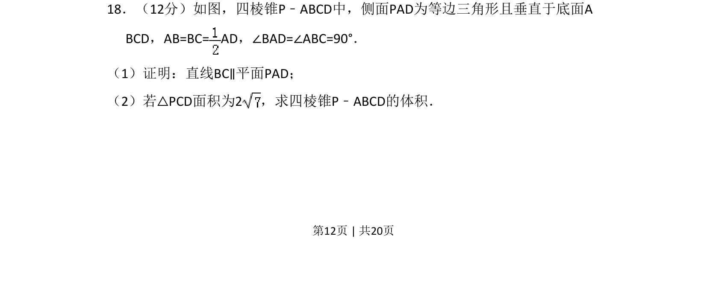
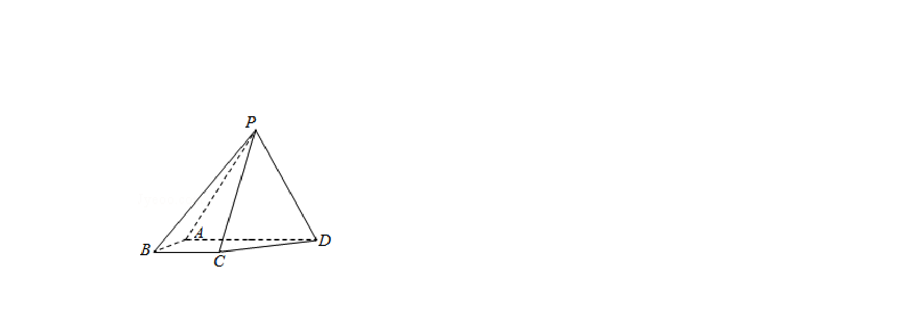
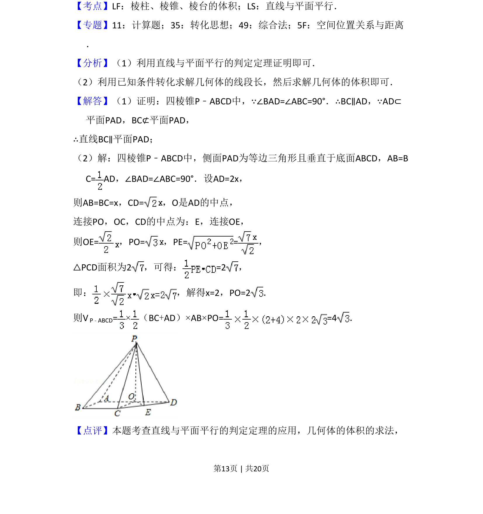
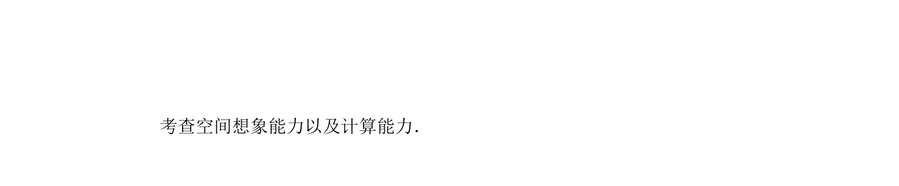

## 题面

## 摘要

四棱锥中证明线面平行，利用面面垂直性质求体积计算。

## 关联考点

- [[1400-线面平行的判定|线面平行判定]]
- [[593-面面垂直性质|面面垂直性质]]
- [[937-棱锥体积计算|棱锥体积计算]]

## 答案与解析

> 📄 原 PDF 第 12 页：`素材/真题/吉林/2008-2024·（吉林）数学高考真题/2017年高考数学试卷（文）（新课标Ⅱ）（解析卷）.pdf`

<!-- 题干文本-start -->
## 题干文本
18．（12分）如图，四棱锥P﹣ABCD中，侧面PAD为等边三角形且垂直于底面A
BCD，AB=BC= AD，∠BAD=∠ABC=90°．
（1）证明：直线BC∥平面PAD；
（2）若△PCD面积为2，求四棱锥P﹣ABCD的体积．
<!-- 题干文本-end -->

<!-- 解析文本-start -->
## 解析文本

<!-- 解析文本-end -->
