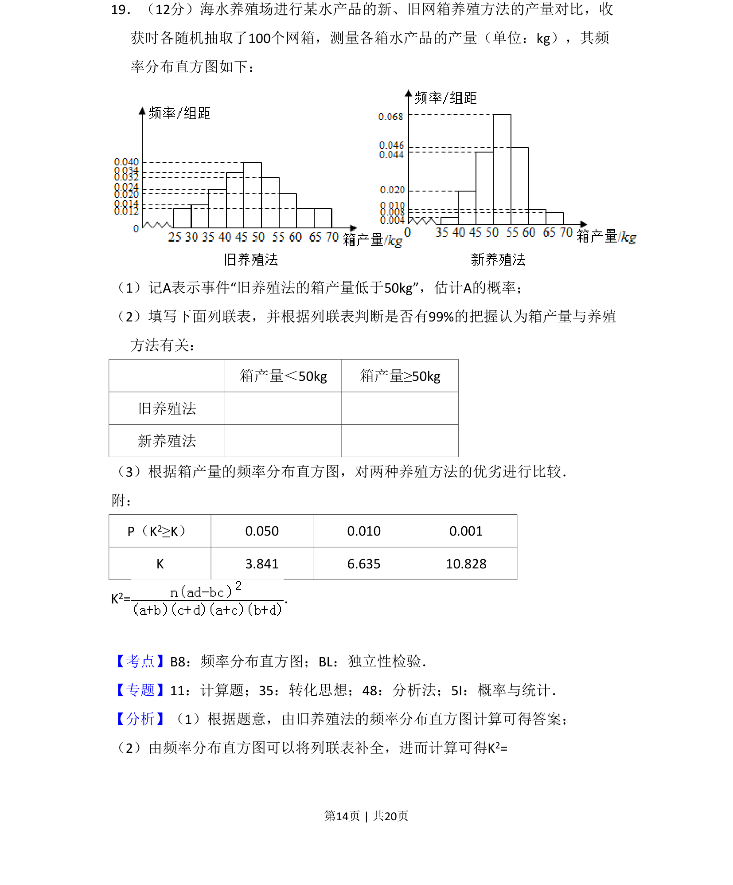
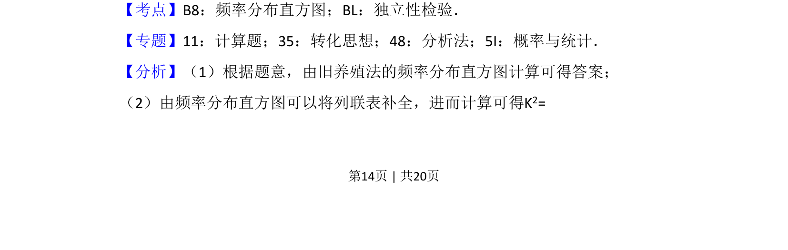
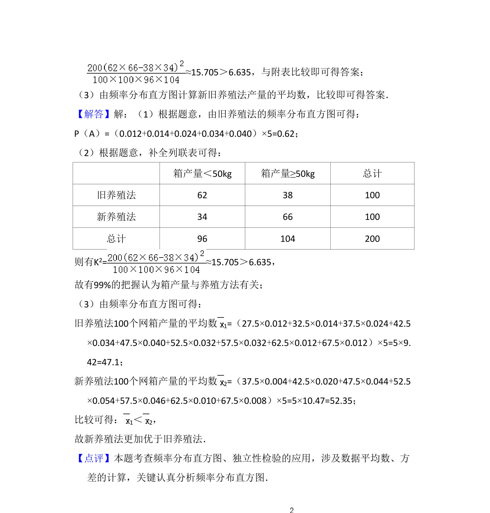

## 题面

## 摘要

该题考查频率分布直方图读取概率、列联表填写与独立性检验的比较。

## 关联考点

- [[364-频率分布直方图|频率分布直方图]]
- [[497-独立性检验|独立性检验]]
- [[465-2x2列联表|列联表]]

## 答案与解析

> 📄 原 PDF 第 14 页：`素材/真题/吉林/2008-2024·（吉林）数学高考真题/2017年高考数学试卷（文）（新课标Ⅱ）（解析卷）.pdf`
