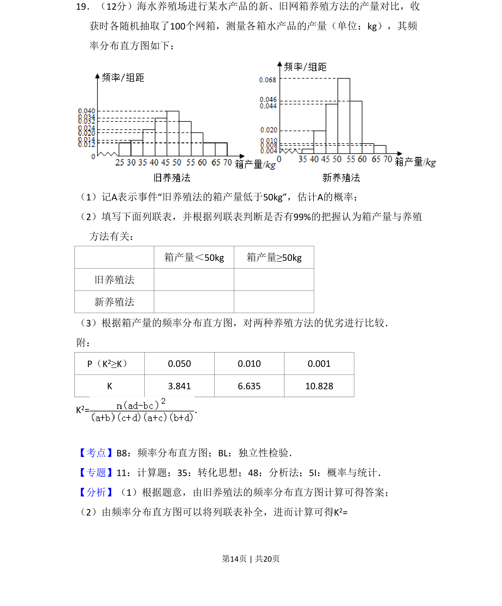
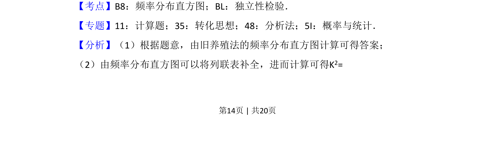
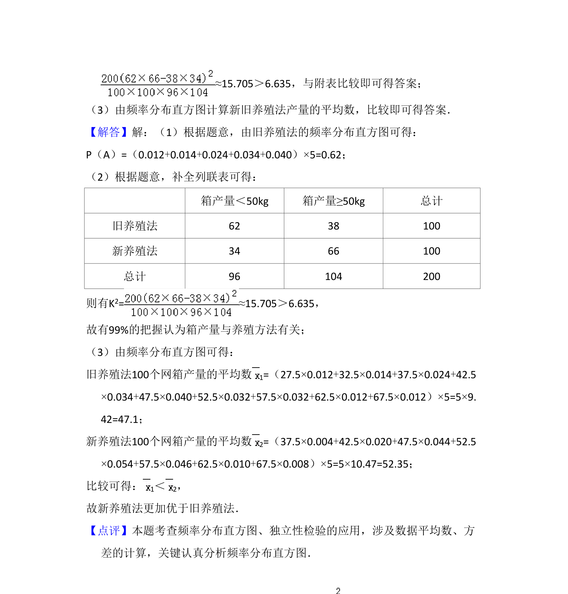

## 题面

## 摘要

该题考查频率分布直方图读取概率、列联表填写与独立性检验的比较。

## 关联考点

- [[364-频率分布直方图|频率分布直方图]]
- [[497-独立性检验|独立性检验]]
- [[465-2x2列联表|列联表]]

## 答案与解析

> 📄 原 PDF 第 14 页：`素材/真题/吉林/2008-2024·（吉林）数学高考真题/2017年高考数学试卷（文）（新课标Ⅱ）（解析卷）.pdf`

<!-- 题干文本-start -->
## 题干文本
19．（12分）海水养殖场进行某水产品的新、旧网箱养殖方法的产量对比，收
获时各随机抽取了100个网箱，测量各箱水产品的产量（单位：kg），其频
率分布直方图如下：
（1）记A表示事件“旧养殖法的箱产量低于50kg”，估计A的概率；
（2）填写下面列联表，并根据列联表判断是否有99%的把握认为箱产量与养殖
方法有关：
箱产量＜50kg 箱产量≥50kg
旧养殖法
新养殖法
（3）根据箱产量的频率分布直方图，对两种养殖方法的优劣进行比较．
附：
P（K2≥K） 0.050 0.010 0.001
K 3.841 6.635 10.828
K2=．
<!-- 题干文本-end -->

<!-- 解析文本-start -->
## 解析文本
【考点】B8：频率分布直方图；BL：独立性检验．菁优网版权所有
【专题】11：计算题；35：转化思想；48：分析法；5I：概率与统计．
【分析】（1）根据题意，由旧养殖法的频率分布直方图计算可得答案；
（2）由频率分布直方图可以将列联表补全，进而计算可得K2=
<!-- 解析文本-end -->
