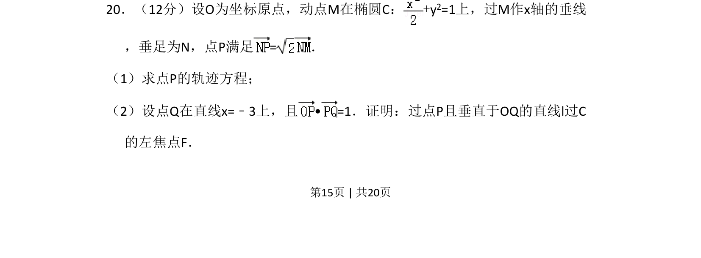
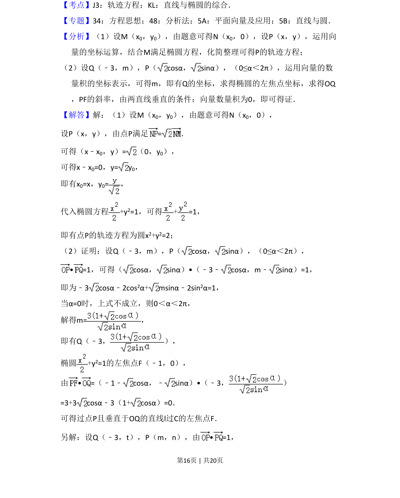
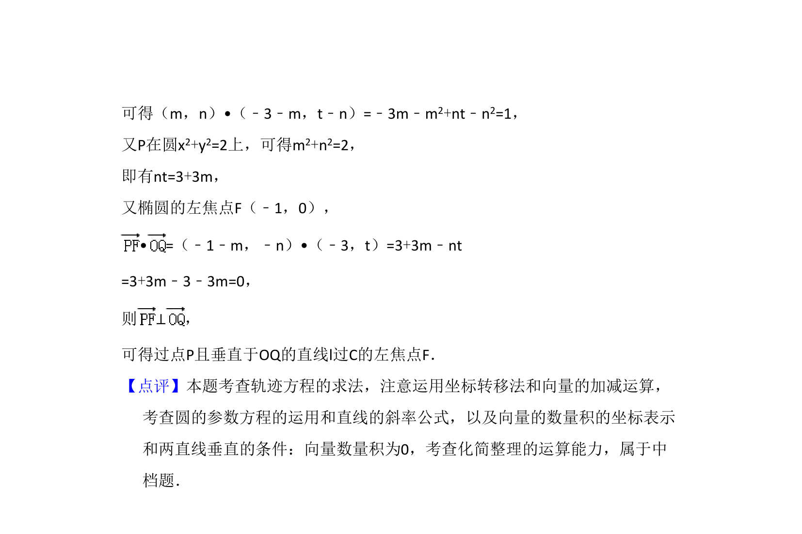

## 题面

## 摘要

已知椭圆上动点及向量关系，求动点轨迹方程，并利用向量垂直证明相关直线过左焦点。

## 关联考点

- [[940-椭圆方程|椭圆方程]]
- [[376-圆锥曲线轨迹问题|轨迹方程]]
- [[751-向量数量积|向量数量积]]
- [[1030-直线过定点|直线过定点]]

## 答案与解析

> 📄 原 PDF 第 15 页：`素材/真题/吉林/2008-2024·（吉林）数学高考真题/2017年高考数学试卷（文）（新课标Ⅱ）（解析卷）.pdf`
