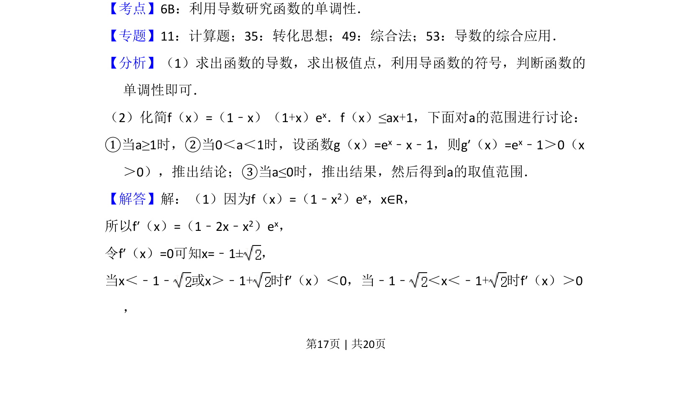

## 题面

## 摘要

本题考查含参数的函数单调性讨论，以及不等式恒成立条件下求参数取值范围。

## 关联考点

- [[导数与单调性]]
- [[不等式恒成立]]
- [[424-参数分类讨论|分类讨论]]

## 答案与解析

> 📄 原 PDF 第 17 页：`素材/真题/吉林/2008-2024·（吉林）数学高考真题/2017年高考数学试卷（文）（新课标Ⅱ）（解析卷）.pdf`
