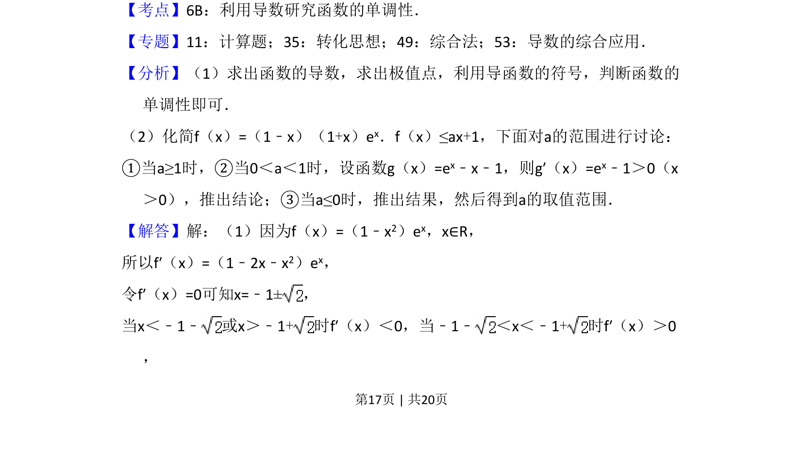
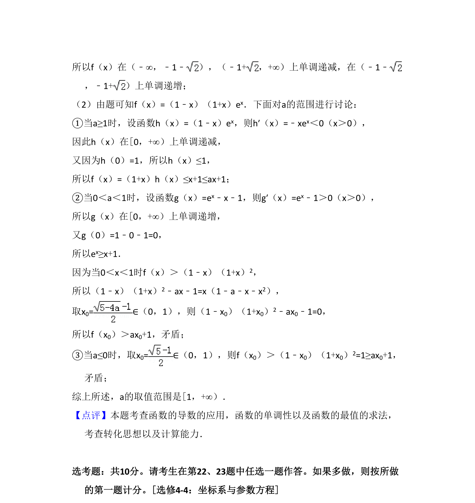

## 题面

## 摘要

本题考查含参数的函数单调性讨论，以及不等式恒成立条件下求参数取值范围。

## 关联考点

- [[705-利用导数研究函数的单调性|导数与单调性]]
- [[531-不等式恒成立|不等式恒成立]]
- [[424-参数分类讨论|分类讨论]]

## 答案与解析

> 📄 原 PDF 第 17 页：`素材/真题/吉林/2008-2024·（吉林）数学高考真题/2017年高考数学试卷（文）（新课标Ⅱ）（解析卷）.pdf`

<!-- 题干文本-start -->
## 题干文本
21．（12分）设函数f（x）=（1﹣x2）ex．
（1）讨论f（x）的单调性；
（2）当x≥0时，f（x）≤ax+1，求a的取值范围．
<!-- 题干文本-end -->

<!-- 解析文本-start -->
## 解析文本
【考点】6B：利用导数研究函数的单调性．菁优网版权所有
【专题】11：计算题；35：转化思想；49：综合法；53：导数的综合应用．
【分析】（1）求出函数的导数，求出极值点，利用导函数的符号，判断函数的
单调性即可．
（2）化简f（x）=（1﹣x）（1+x）ex．f（x）≤ax+1，下面对a的范围进行讨论：
①当a≥1时，②当0＜a＜1时，设函数g（x）=ex﹣x﹣1，则g′（x）=ex﹣1＞0（x
＞0），推出结论；③当a≤0时，推出结果，然后得到a的取值范围．
【解答】解：（1）因为f（x）=（1﹣x2）ex，x∈R，
所以f′（x）=（1﹣2x﹣x2）ex，
令f′（x）=0可知x=﹣1±，
当x＜﹣1﹣ 或x＞﹣1+时f′（x）＜0，当﹣1﹣ ＜x＜﹣1+时f′（x）＞0
，
<!-- 解析文本-end -->
