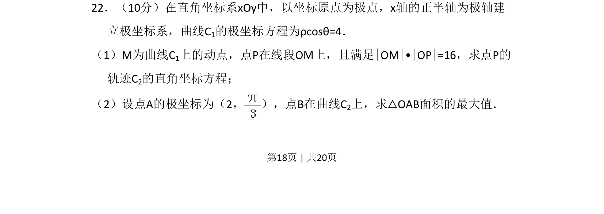
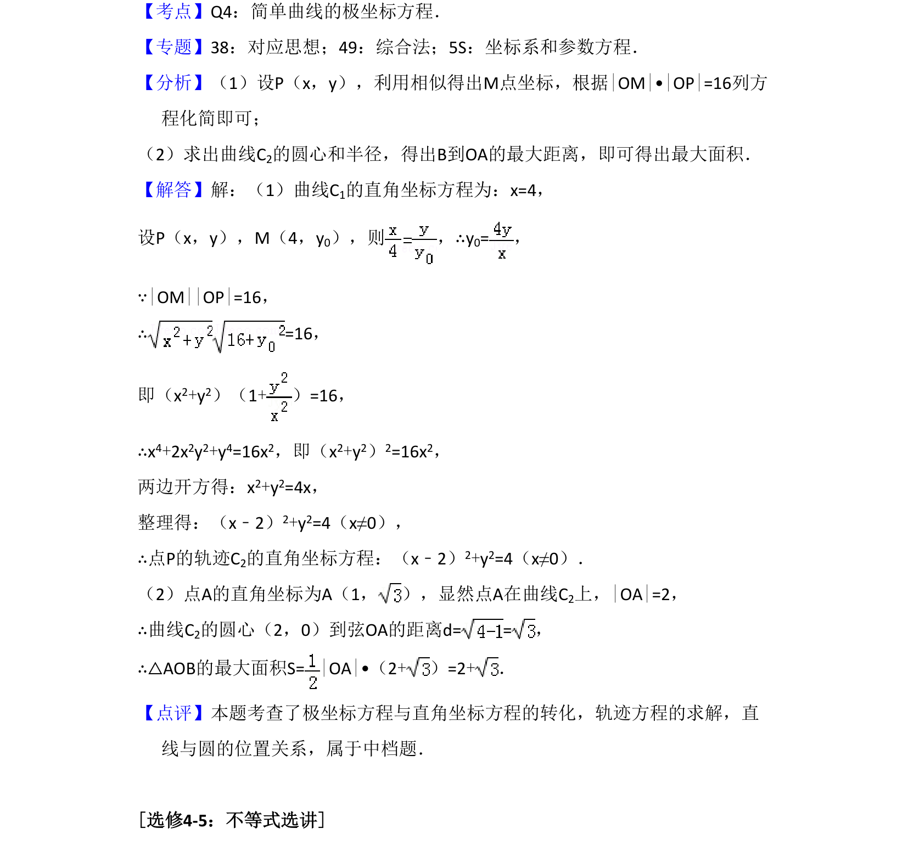

## 题面

## 摘要

极坐标系下动点轨迹求解及三角形面积最值问题

## 关联考点

- [[极坐标与直角坐标互化]]
- [[376-圆锥曲线轨迹问题|轨迹方程]]
- [[062-多边形面积|三角形面积]]
- [[286-函数的最值|最值]]

## 答案与解析

> 📄 原 PDF 第 18 页：`素材/真题/吉林/2008-2024·（吉林）数学高考真题/2017年高考数学试卷（文）（新课标Ⅱ）（解析卷）.pdf`
