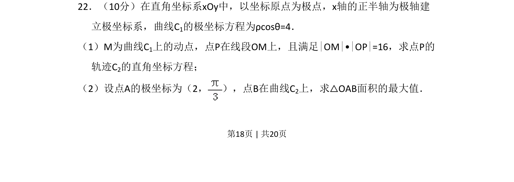
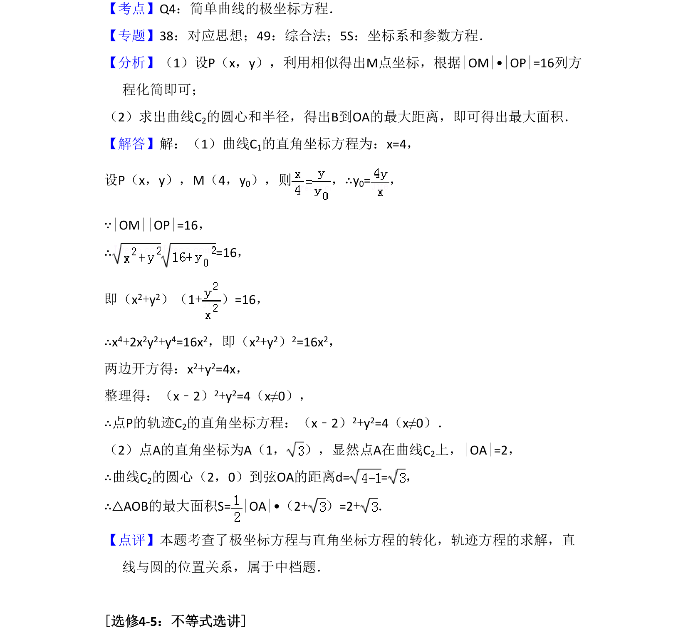

## 题面

## 摘要

极坐标系下动点轨迹求解及三角形面积最值问题

## 关联考点

- [[920-极坐标与直角坐标互化|极坐标与直角坐标互化]]
- [[376-圆锥曲线轨迹问题|轨迹方程]]
- [[062-多边形面积|三角形面积]]
- [[286-函数的最值|最值]]

## 答案与解析

> 📄 原 PDF 第 18 页：`素材/真题/吉林/2008-2024·（吉林）数学高考真题/2017年高考数学试卷（文）（新课标Ⅱ）（解析卷）.pdf`

<!-- 题干文本-start -->
## 题干文本
22．（10分）在直角坐标系xOy中，以坐标原点为极点，x轴的正半轴为极轴建
立极坐标系，曲线C1的极坐标方程为ρcosθ=4．
（1）M为曲线C1上的动点，点P在线段OM上，且满足|OM|•|OP|=16，求点P的
轨迹C2的直角坐标方程；
（2）设点A的极坐标为（2， ），点B在曲线C 2上，求△OAB面积的最大值．
<!-- 题干文本-end -->

<!-- 解析文本-start -->
## 解析文本

<!-- 解析文本-end -->
