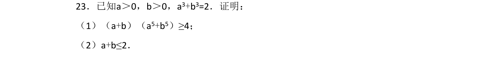
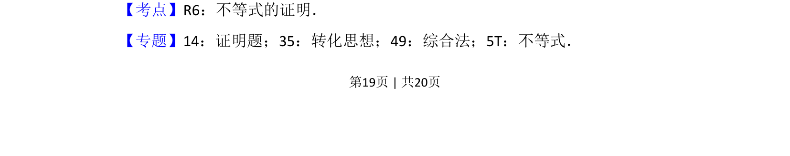
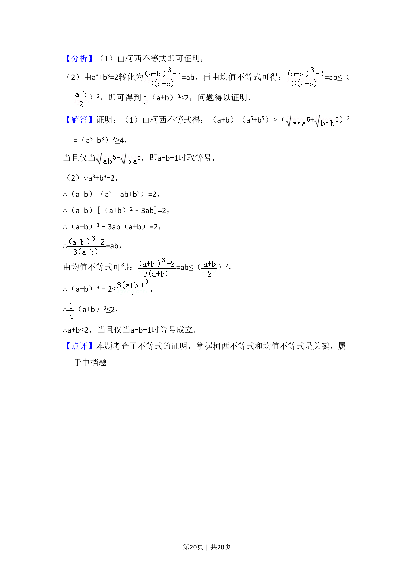

## 题面

## 摘要

已知条件为等式，求证两个不等式，考查不等式的证明方法与转化思想。

## 关联考点

- [[624-不等式的证明|不等式的证明]]
- [[1099-综合法|综合法]]
- [[1125-转化思想|转化思想]]

## 答案与解析

> 📄 原 PDF 第 19 页：`素材/真题/吉林/2008-2024·（吉林）数学高考真题/2017年高考数学试卷（文）（新课标Ⅱ）（解析卷）.pdf`

<!-- 题干文本-start -->
## 题干文本
23．已知a＞0，b＞0，a3+b3=2．证明：
（1）（a+b）（a5+b5）≥4；
（2）a+b≤2．
<!-- 题干文本-end -->

<!-- 解析文本-start -->
## 解析文本
【考点】R6：不等式的证明．菁优网版权所有
【专题】14：证明题；35：转化思想；49：综合法；5T：不等式．
<!-- 解析文本-end -->
