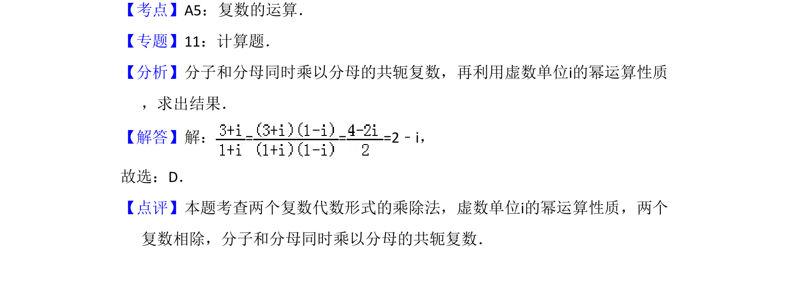

## 题面

## 摘要

该题考查复数的除法运算，要求将复数化简为标准形式。

## 关联考点

- [[811-复数运算|复数的运算]]
- [[804-复数的乘除|复数的乘除]]

## 答案与解析

> 📄 原 PDF 第 1 页：`素材/真题/吉林/2008-2024·（吉林）数学高考真题/2017年高考数学试卷（理）（新课标Ⅱ）（解析卷）.pdf`

<!-- 题干文本-start -->
## 题干文本
1．（5分）=（　　）
A．1+2i B．1﹣2i C．2+i D．2﹣i
<!-- 题干文本-end -->

<!-- 解析文本-start -->
## 解析文本
【考点】A5：复数的运算．菁优网版权所有
【专题】11：计算题．
【分析】分子和分母同时乘以分母的共轭复数，再利用虚数单位i的幂运算性质
，求出结果．
【解答】解：= = =2﹣i，
故选：D．
【点评】本题考查两个复数代数形式的乘除法，虚数单位i的幂运算性质，两个
复数相除，分子和分母同时乘以分母的共轭复数．
<!-- 解析文本-end -->
