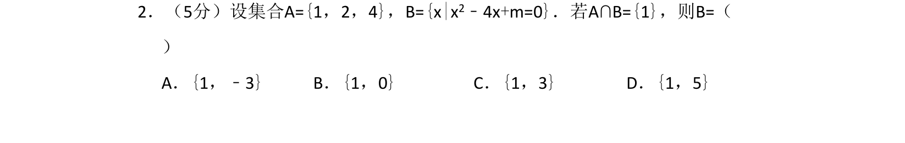
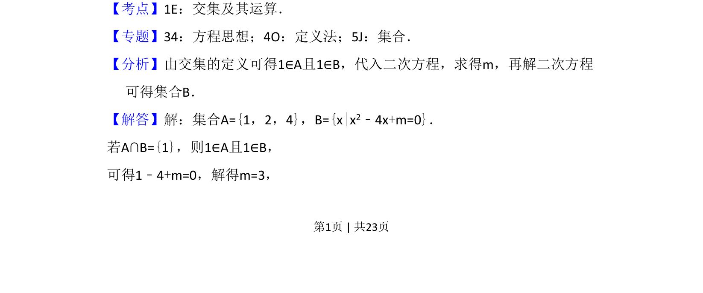
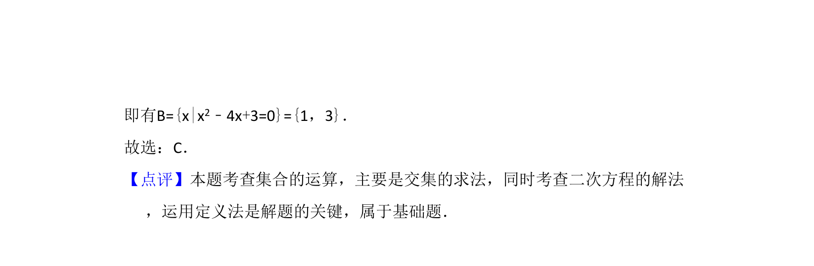

## 题面

## 摘要

本题考查集合交集运算，通过交集元素求参数并确定集合。

## 关联考点

- [[645-交集及其运算|交集及其运算]]
- [[205-一元二次方程|一元二次方程]]
- [[1136-集合元素|集合元素]]

## 答案与解析

> 📄 原 PDF 第 1 页：`素材/真题/吉林/2008-2024·（吉林）数学高考真题/2017年高考数学试卷（理）（新课标Ⅱ）（解析卷）.pdf`
