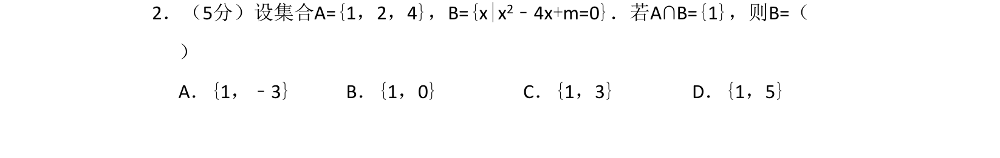
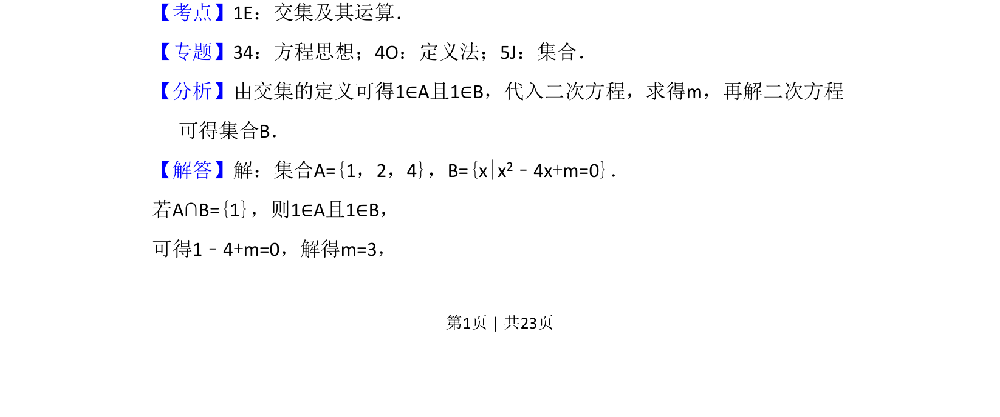
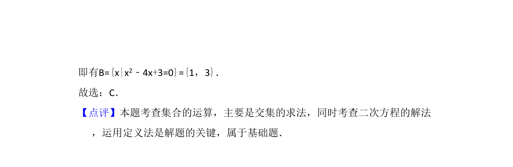

## 题面

## 摘要

本题考查集合交集运算，通过交集元素求参数并确定集合。

## 关联考点

- [[645-交集及其运算|交集及其运算]]
- [[205-一元二次方程|一元二次方程]]
- [[1135-集合元素|集合元素]]

## 答案与解析

> 📄 原 PDF 第 1 页：`素材/真题/吉林/2008-2024·（吉林）数学高考真题/2017年高考数学试卷（理）（新课标Ⅱ）（解析卷）.pdf`

<!-- 题干文本-start -->
## 题干文本
2．（5分）设集合A={1，2，4}，B={x|x2﹣4x+m=0}．若A∩B={1}，则B=（　　
）
A．{1，﹣3}B．{1，0}C．{1，3}D．{1，5}
<!-- 题干文本-end -->

<!-- 解析文本-start -->
## 解析文本
【考点】1E：交集及其运算．菁优网版权所有
【专题】34：方程思想；4O：定义法；5J：集合．
【分析】由交集的定义可得1∈A且1∈B，代入二次方程，求得m，再解二次方程
可得集合B．
【解答】解：集合A={1，2，4}，B={x|x2﹣4x+m=0}．
若A∩B={1}，则1∈A且1∈B，
可得1﹣4+m=0，解得m=3，
<!-- 解析文本-end -->
