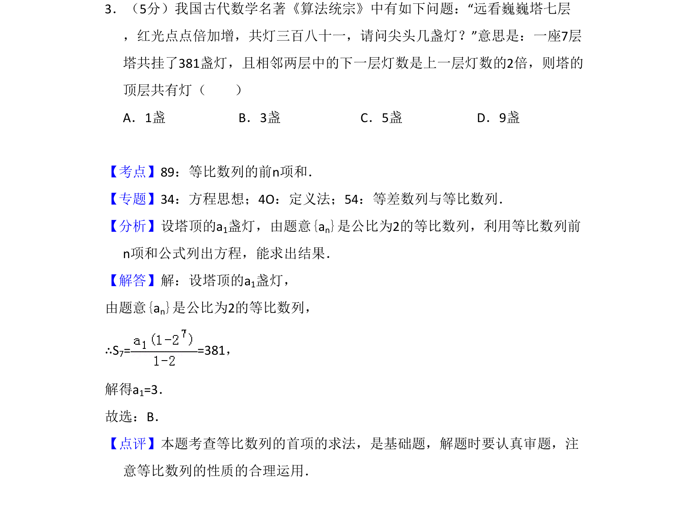
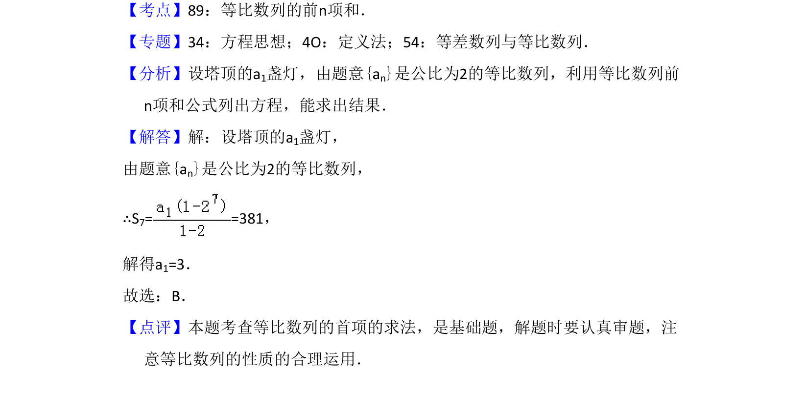

## 题面

## 摘要

本题以古代数学问题为背景，考查等比数列前n项和公式的应用，通过建立方程求首项。

## 关联考点

- [[358-等比数列概念|等比数列]]
- [[355-等差数列前n项和|前n项和]]
- [[906-方程思想|方程思想]]

## 答案与解析

> 📄 原 PDF 第 2 页：`素材/真题/吉林/2008-2024·（吉林）数学高考真题/2017年高考数学试卷（理）（新课标Ⅱ）（解析卷）.pdf`

<!-- 题干文本-start -->
## 题干文本
3．（5分）我国古代数学名著《算法统宗》中有如下问题：“远看巍巍塔七层
，红光点点倍加增，共灯三百八十一，请问尖头几盏灯？”意思是：一座7层
塔共挂了381盏灯，且相邻两层中的下一层灯数是上一层灯数的2倍，则塔的
顶层共有灯（　　）
A．1盏B．3盏C．5盏D．9盏
<!-- 题干文本-end -->

<!-- 解析文本-start -->
## 解析文本
【考点】89：等比数列的前n项和．菁优网版权所有
【专题】34：方程思想；4O：定义法；54：等差数列与等比数列．
【分析】设塔顶的a1盏灯，由题意{an}是公比为2的等比数列，利用等比数列前
n项和公式列出方程，能求出结果．
【解答】解：设塔顶的a1盏灯，
由题意{an}是公比为2的等比数列，
∴S7= =381，
解得a1=3．
故选：B．
【点评】本题考查等比数列的首项的求法，是基础题，解题时要认真审题，注
意等比数列的性质的合理运用．
<!-- 解析文本-end -->
