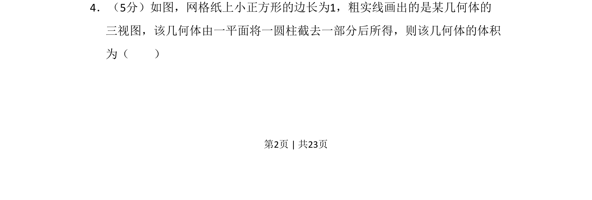
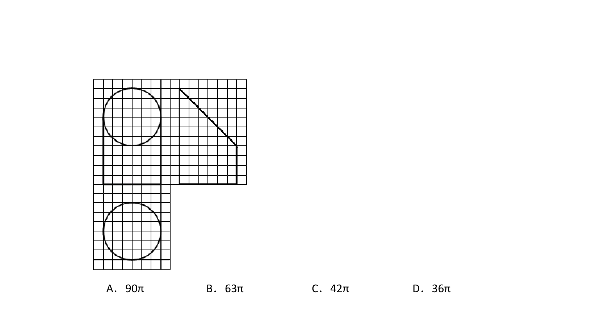
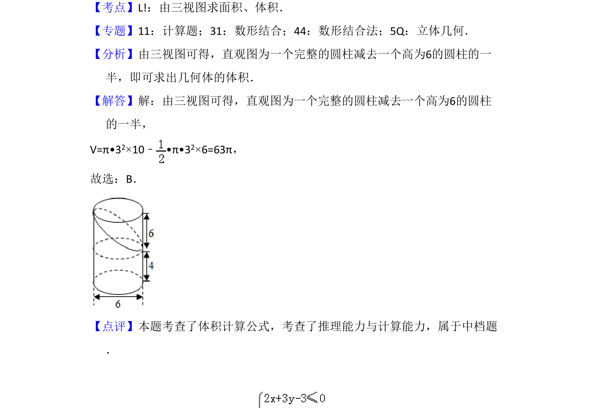

## 题面

## 摘要

考查三视图还原几何体，计算圆柱被平面截切后的不规则几何体体积。

## 关联考点

- [[235-三视图|三视图]]
- [[662-几何体体积|几何体体积]]
- [[714-割补法|割补法]]

## 答案与解析

> 📄 原 PDF 第 2 页：`素材/真题/吉林/2008-2024·（吉林）数学高考真题/2017年高考数学试卷（理）（新课标Ⅱ）（解析卷）.pdf`
