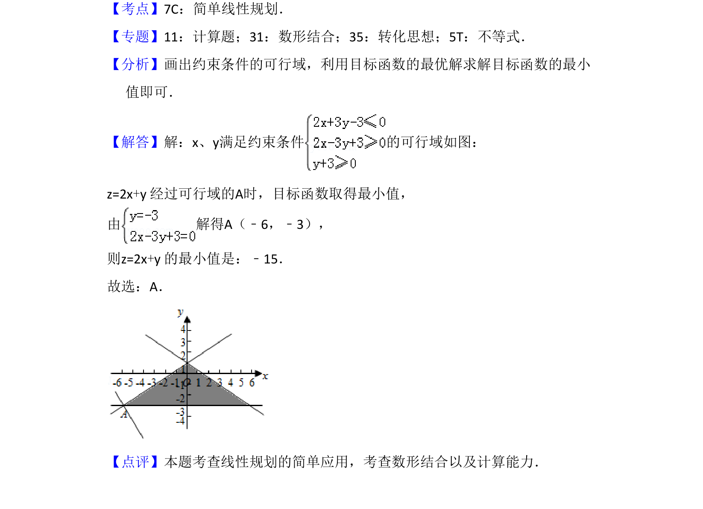

## 题面

## 摘要

该题考查线性规划中目标函数在给定约束条件下的最小值求解。

## 关联考点

- [[1074-简单线性规划|线性规划]]
- [[1156-可行域|可行域]]
- [[999-目标函数|目标函数]]
- [[286-函数的最值|最值]]

## 答案与解析

> 📄 原 PDF 第 3 页：`素材/真题/吉林/2008-2024·（吉林）数学高考真题/2017年高考数学试卷（理）（新课标Ⅱ）（解析卷）.pdf`
