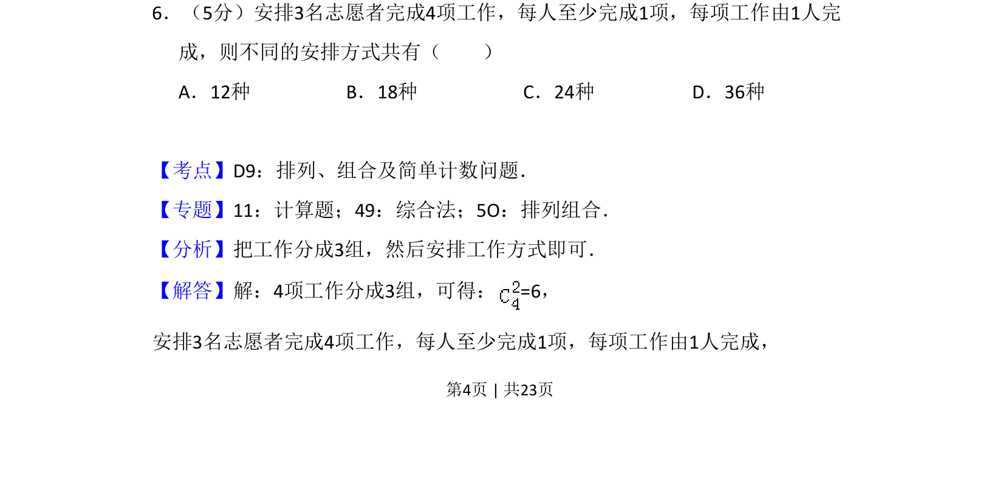

## 题面

## 摘要

考查将4项工作分配给3名志愿者且每人至少1项的分组与分配计数问题

## 关联考点

- [[487-排列概念|排列]]
- [[505-组合概念|组合]]
- [[分组分配]]
- [[计数原理]]

## 答案与解析

> 📄 原 PDF 第 4 页：`素材/真题/吉林/2008-2024·（吉林）数学高考真题/2017年高考数学试卷（理）（新课标Ⅱ）（解析卷）.pdf`
