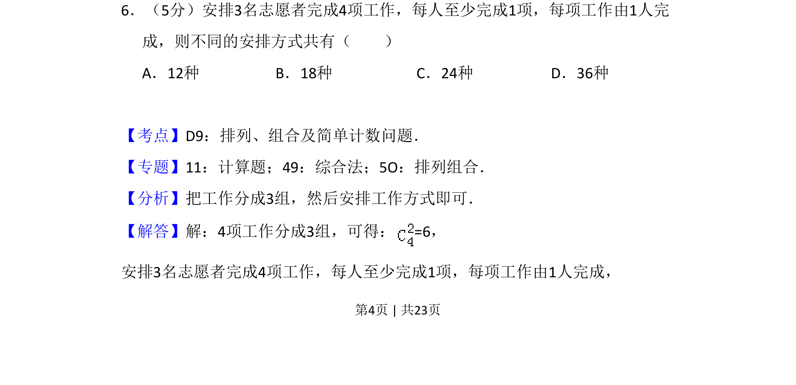
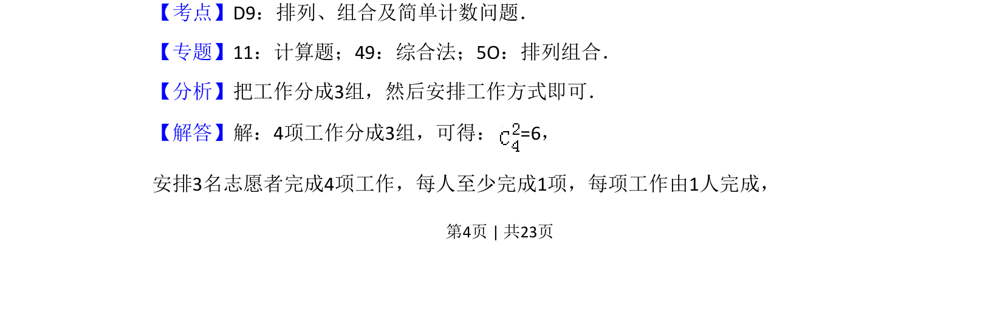
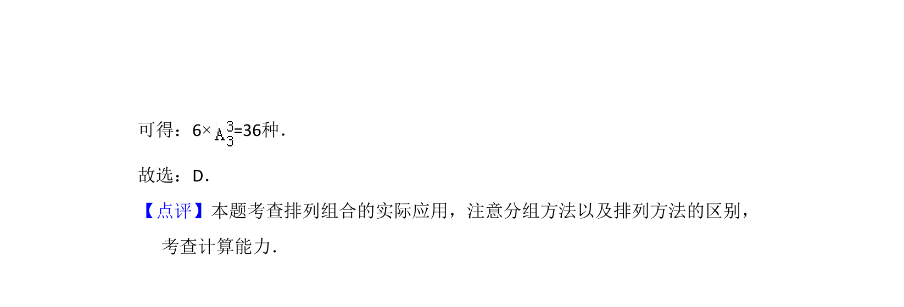

## 题面

## 摘要

考查将4项工作分配给3名志愿者且每人至少1项的分组与分配计数问题

## 关联考点

- [[487-排列概念|排列]]
- [[505-组合概念|组合]]
- [[699-分组分配|分组分配]]
- [[1112-计数原理|计数原理]]

## 答案与解析

> 📄 原 PDF 第 4 页：`素材/真题/吉林/2008-2024·（吉林）数学高考真题/2017年高考数学试卷（理）（新课标Ⅱ）（解析卷）.pdf`

<!-- 题干文本-start -->
## 题干文本
6．（5分）安排3名志愿者完成4项工作，每人至少完成1项，每项工作由1人完
成，则不同的安排方式共有（　　）
A．12种B．18种C．24种D．36种
<!-- 题干文本-end -->

<!-- 解析文本-start -->
## 解析文本
【考点】D9：排列、组合及简单计数问题．菁优网版权所有
【专题】11：计算题；49：综合法；5O：排列组合．
【分析】把工作分成3组，然后安排工作方式即可．
【解答】解：4项工作分成3组，可得：=6，
安排3名志愿者完成4项工作，每人至少完成1项，每项工作由1人完成，
<!-- 解析文本-end -->
