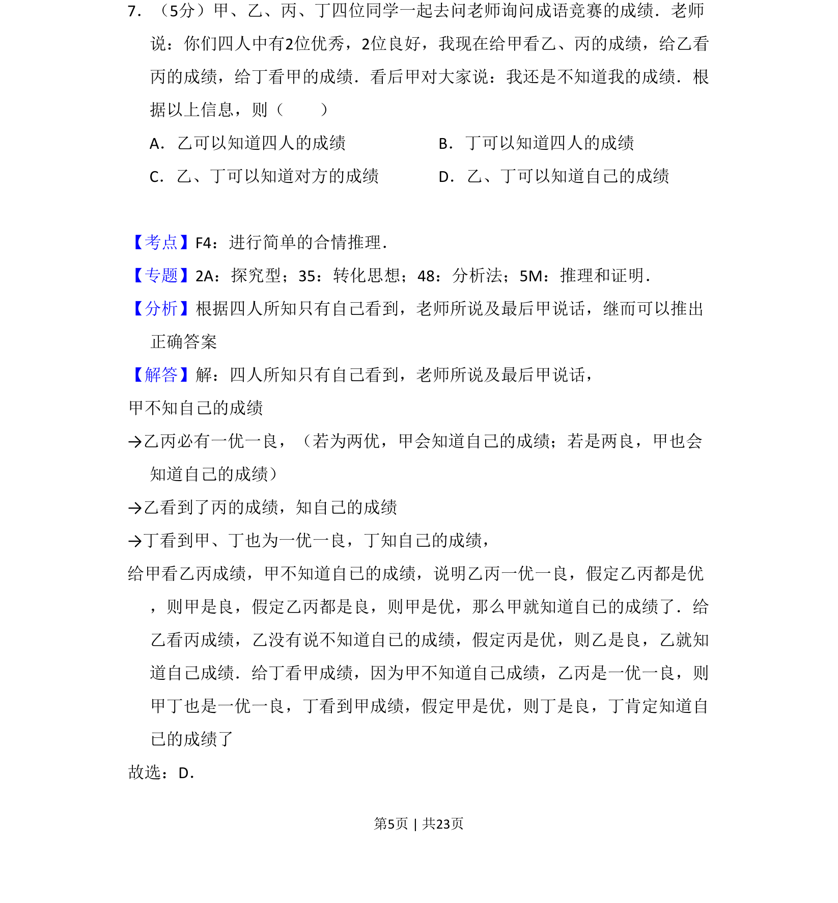
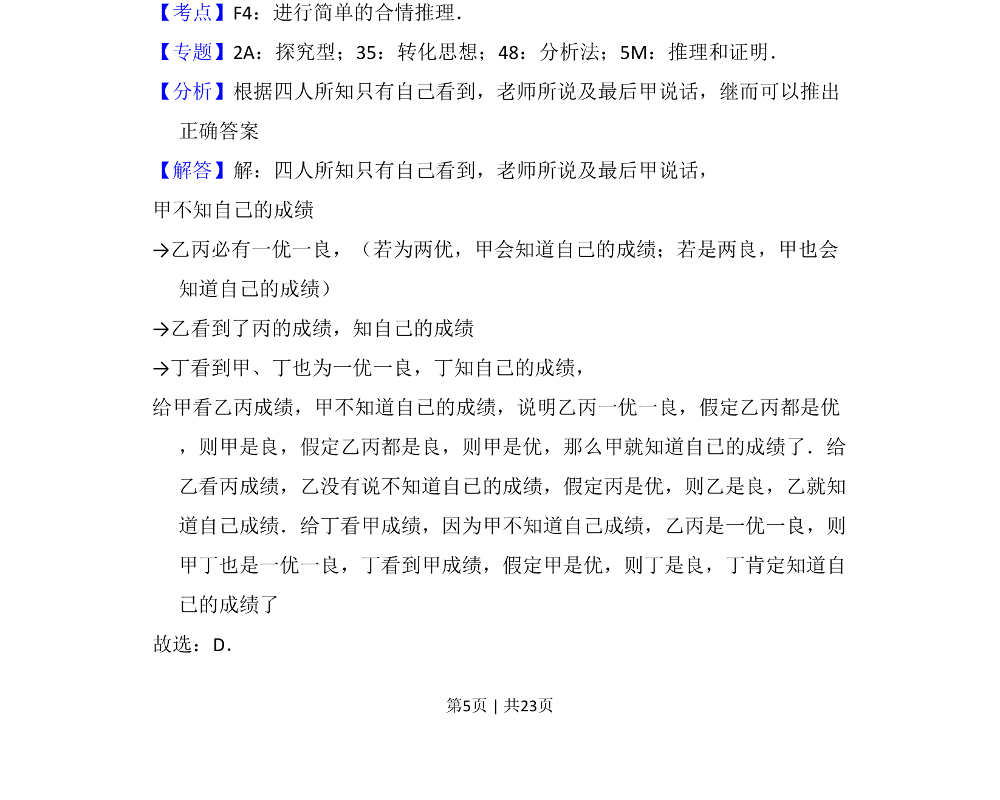
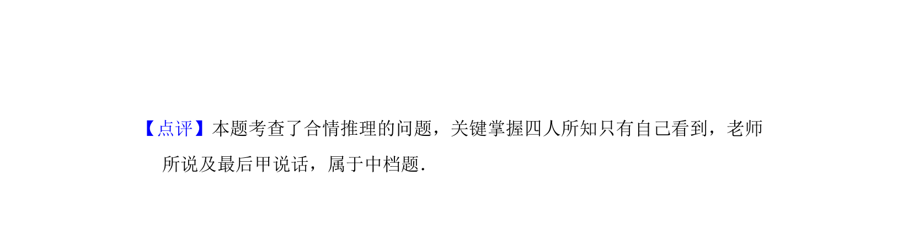

## 题面

## 摘要

本题为逻辑推理题，通过成绩信息推断四人能否知道自己的成绩。

## 关联考点

- [[740-合情推理|合情推理]]
- [[037-推理|逻辑推理]]
- [[915-条件分析|条件分析]]

## 答案与解析

> 📄 原 PDF 第 5 页：`素材/真题/吉林/2008-2024·（吉林）数学高考真题/2017年高考数学试卷（理）（新课标Ⅱ）（解析卷）.pdf`

<!-- 题干文本-start -->
## 题干文本
7．（5分）甲、乙、丙、丁四位同学一起去问老师询问成语竞赛的成绩．老师
说：你们四人中有2位优秀，2位良好，我现在给甲看乙、丙的成绩，给乙看
丙的成绩，给丁看甲的成绩．看后甲对大家说：我还是不知道我的成绩．根
据以上信息，则（　　）
A．乙可以知道四人的成绩B．丁可以知道四人的成绩
C．乙、丁可以知道对方的成绩D．乙、丁可以知道自己的成绩
<!-- 题干文本-end -->

<!-- 解析文本-start -->
## 解析文本
【考点】F4：进行简单的合情推理．菁优网版权所有
【专题】2A：探究型；35：转化思想；48：分析法；5M：推理和证明．
【分析】根据四人所知只有自己看到，老师所说及最后甲说话，继而可以推出
正确答案
【解答】解：四人所知只有自己看到，老师所说及最后甲说话，
甲不知自己的成绩
→乙丙必有一优一良，（若为两优，甲会知道自己的成绩；若是两良，甲也会
知道自己的成绩）
→乙看到了丙的成绩，知自己的成绩
→丁看到甲、丁也为一优一良，丁知自己的成绩，
给甲看乙丙成绩，甲不知道自已的成绩，说明乙丙一优一良，假定乙丙都是优
，则甲是良，假定乙丙都是良，则甲是优，那么甲就知道自已的成绩了．给
乙看丙成绩，乙没有说不知道自已的成绩，假定丙是优，则乙是良，乙就知
道自己成绩．给丁看甲成绩，因为甲不知道自己成绩，乙丙是一优一良，则
甲丁也是一优一良，丁看到甲成绩，假定甲是优，则丁是良，丁肯定知道自
已的成绩了
故选：D．
<!-- 解析文本-end -->
