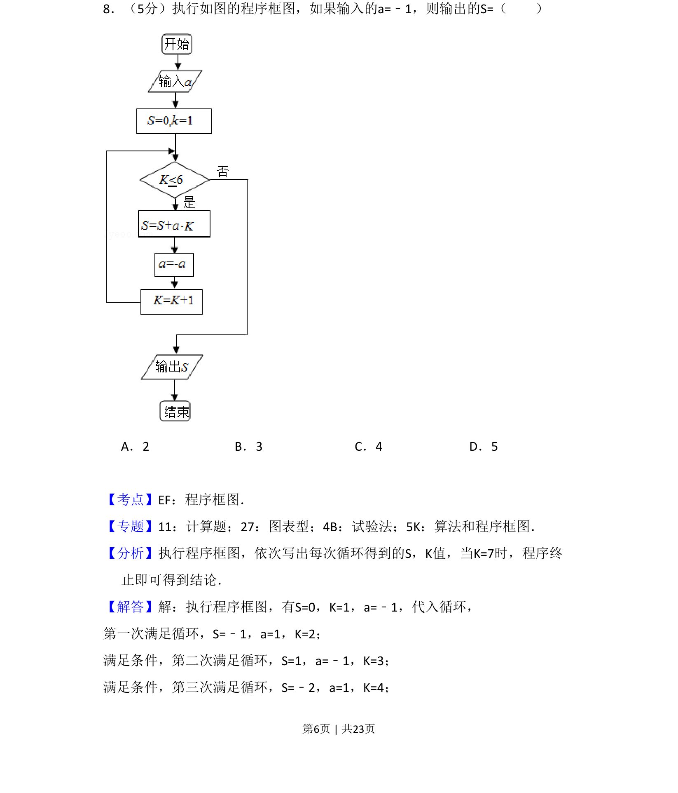
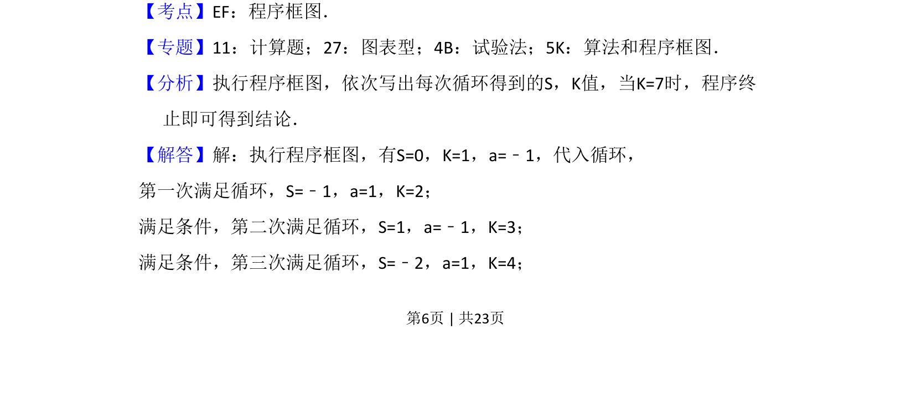
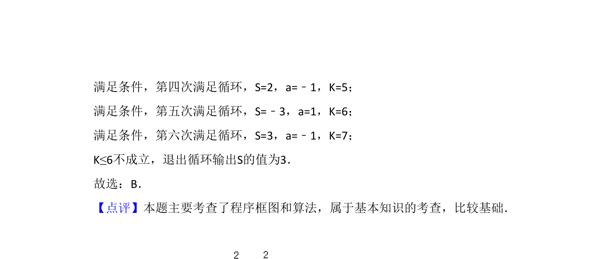

## 题面

## 摘要

执行程序框图，计算给定初始值下的输出结果。

## 关联考点

- [[1042-程序框图|程序框图]]
- [[870-循环结构|循环结构]]
- [[1075-算法|算法]]

## 答案与解析

> 📄 原 PDF 第 6 页：`素材/真题/吉林/2008-2024·（吉林）数学高考真题/2017年高考数学试卷（理）（新课标Ⅱ）（解析卷）.pdf`

<!-- 题干文本-start -->
## 题干文本
8．（5分）执行如图的程序框图，如果输入的a=﹣1，则输出的S=（　　）
A．2 B．3 C．4 D．5
<!-- 题干文本-end -->

<!-- 解析文本-start -->
## 解析文本
【考点】EF：程序框图．菁优网版权所有
【专题】11：计算题；27：图表型；4B：试验法；5K：算法和程序框图．
【分析】执行程序框图，依次写出每次循环得到的S，K值，当K=7时，程序终
止即可得到结论．
【解答】解：执行程序框图，有S=0，K=1，a=﹣1，代入循环，
第一次满足循环，S=﹣1，a=1，K=2；
满足条件，第二次满足循环，S=1，a=﹣1，K=3；
满足条件，第三次满足循环，S=﹣2，a=1，K=4；
<!-- 解析文本-end -->
