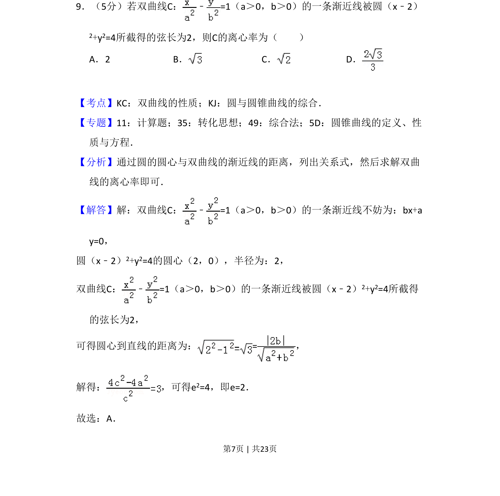
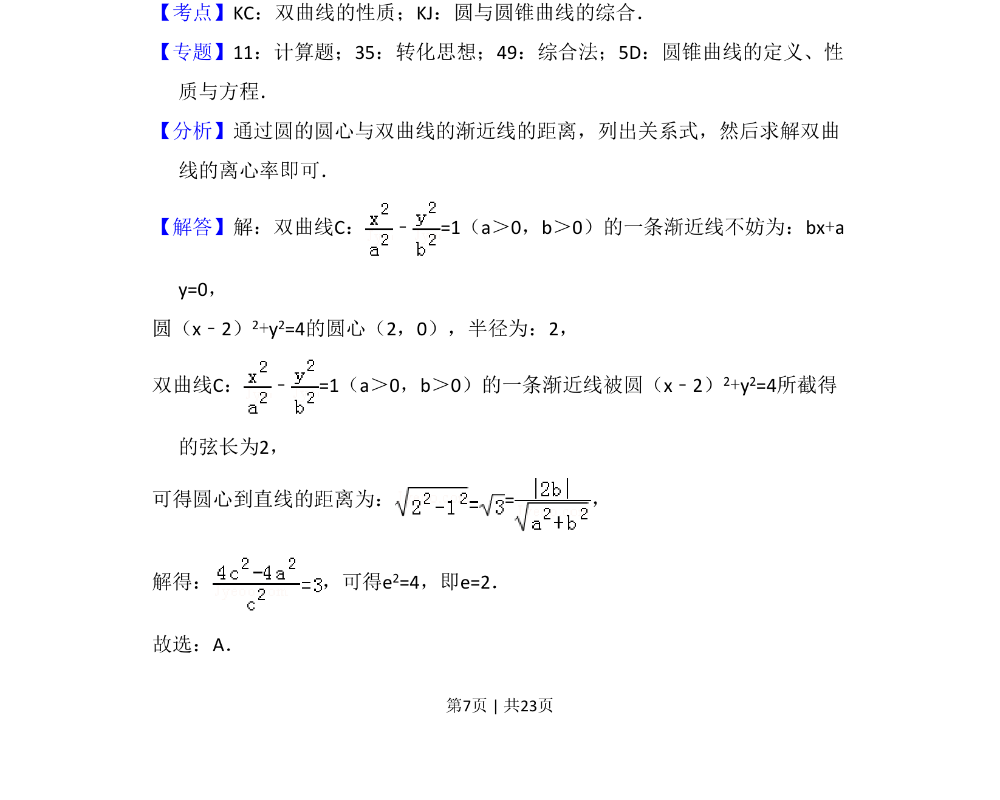
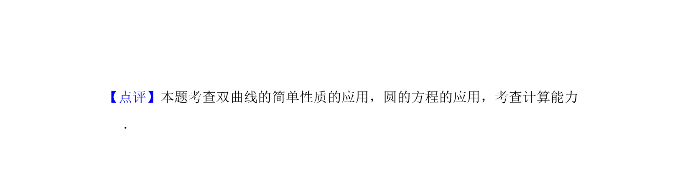

## 题面

## 摘要

双曲线渐近线被圆截弦长，求离心率

## 关联考点

- [[731-双曲线的性质|双曲线的性质]]
- [[781-圆的性质|圆的性质]]
- [[1211-点到直线距离|点到直线距离]]
- [[391-椭圆离心率|离心率]]

## 答案与解析

> 📄 原 PDF 第 7 页：`素材/真题/吉林/2008-2024·（吉林）数学高考真题/2017年高考数学试卷（理）（新课标Ⅱ）（解析卷）.pdf`

<!-- 题干文本-start -->
## 题干文本
9．（5分）若双曲线C： ﹣=1（a＞0，b＞0）的一条渐近线被圆（x﹣2）
2+y2=4所截得的弦长为2，则C的离心率为（　　）
A．2 B．C．D．
<!-- 题干文本-end -->

<!-- 解析文本-start -->
## 解析文本
【考点】KC：双曲线的性质；KJ：圆与圆锥曲线的综合．菁优网版权所有
【专题】11：计算题；35：转化思想；49：综合法；5D：圆锥曲线的定义、性
质与方程．
【分析】通过圆的圆心与双曲线的渐近线的距离，列出关系式，然后求解双曲
线的离心率即可．
【解答】解：双曲线C： ﹣=1（a＞0，b＞0）的一条渐近线不妨为：bx+a
y=0，
圆（x﹣2）2+y2=4的圆心（2，0），半径为：2，
双曲线C： ﹣=1（a＞0，b＞0）的一条渐近线被圆（x﹣2） 2+y2=4所截得
的弦长为2，
可得圆心到直线的距离为：=，
解得： ，可得e 2=4，即e=2．
故选：A．
<!-- 解析文本-end -->
