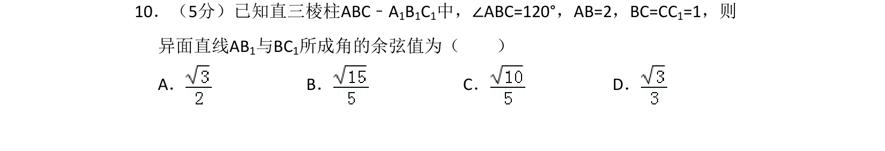
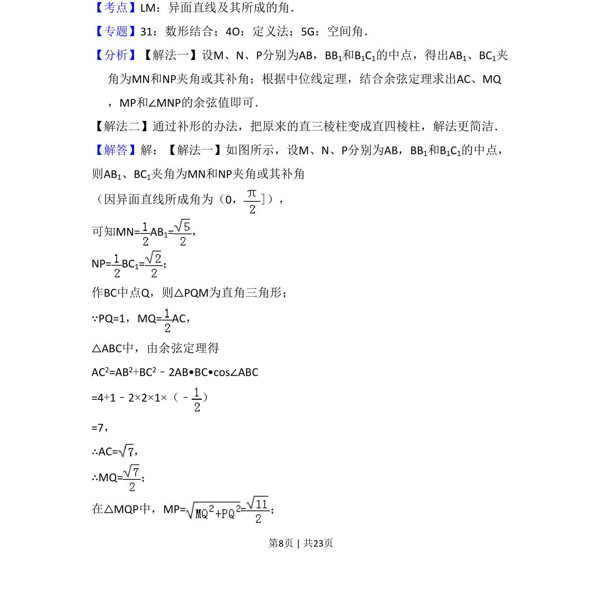
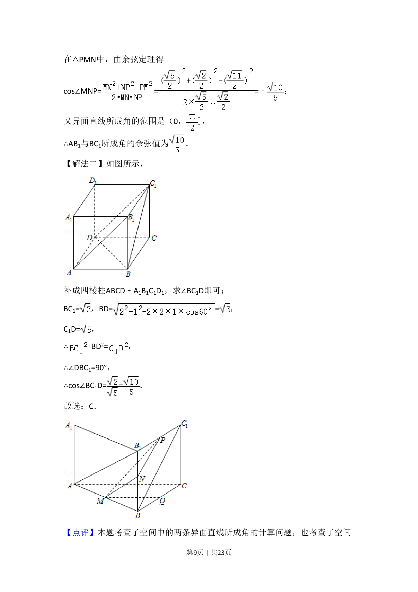
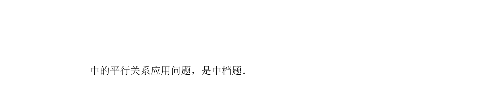

## 题面

## 摘要

已知直三棱柱中求异面直线所成角的余弦值，通过几何法或补形法求解。

## 关联考点

- [[862-异面直线及其所成的角|异面直线及其所成的角]]
- [[126-定理|余弦定理]]
- [[1044-空间几何|空间几何]]

## 答案与解析

> 📄 原 PDF 第 8 页：`素材/真题/吉林/2008-2024·（吉林）数学高考真题/2017年高考数学试卷（理）（新课标Ⅱ）（解析卷）.pdf`

<!-- 题干文本-start -->
## 题干文本
10．（5分）已知直三棱柱ABC﹣A1B1C1中，∠ABC=120°，AB=2，BC=CC1=1，则
异面直线AB1与BC1所成角的余弦值为（　　）
A．B．C．D．
<!-- 题干文本-end -->

<!-- 解析文本-start -->
## 解析文本
【考点】LM：异面直线及其所成的角．菁优网版权所有
【专题】31：数形结合；4O：定义法；5G：空间角．
【分析】【解法一】设M、N、P分别为AB，BB1和B1C1的中点，得出AB1、BC1夹
角为MN和NP夹角或其补角；根据中位线定理，结合余弦定理求出AC、MQ
，MP和∠MNP的余弦值即可．
【解法二】通过补形的办法，把原来的直三棱柱变成直四棱柱，解法更简洁．
【解答】解：【解法一】如图所示，设M、N、P分别为AB，BB1和B1C1的中点，
则AB1、BC1夹角为MN和NP夹角或其补角
（因异面直线所成角为（0，]），
可知MN= AB 1=，
NP= BC 1=；
作BC中点Q，则△PQM为直角三角形；
∵PQ=1，MQ= AC，
△ABC中，由余弦定理得
AC2=AB2+BC2﹣2AB•BC•cos∠ABC
=4+1﹣2×2×1×（﹣ ）
=7，
∴AC=，
∴MQ=；
在△MQP中，MP= =；
<!-- 解析文本-end -->
