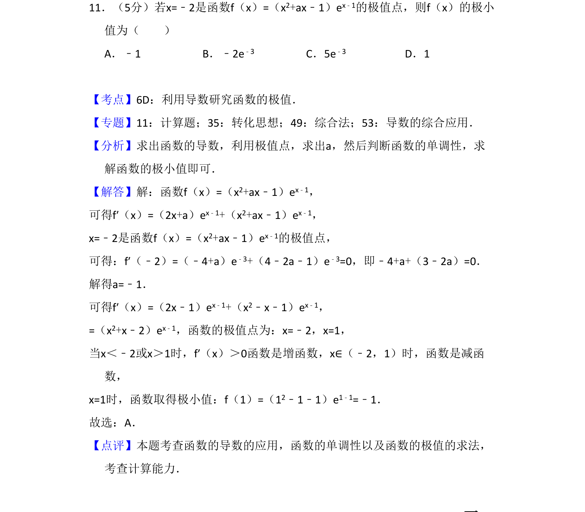
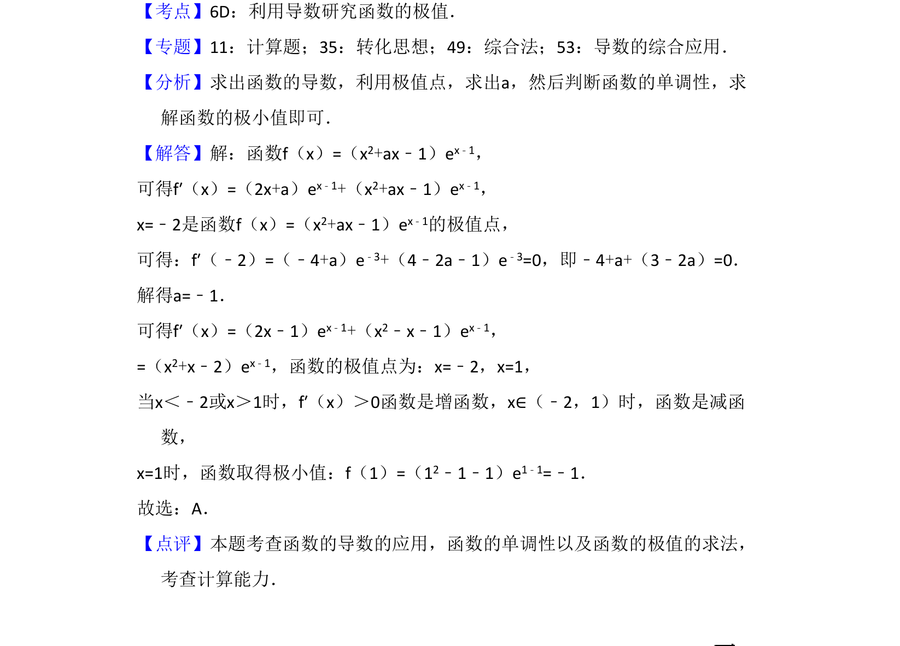

## 题面

## 摘要

已知极值点求参数，再求函数的极小值

## 关联考点

- [[707-利用导数研究函数的极值|利用导数研究函数的极值]]
- [[282-函数的单调性|函数的单调性]]
- [[549-导数运算|导数的运算]]

## 答案与解析

> 📄 原 PDF 第 10 页：`素材/真题/吉林/2008-2024·（吉林）数学高考真题/2017年高考数学试卷（理）（新课标Ⅱ）（解析卷）.pdf`

<!-- 题干文本-start -->
## 题干文本
11．（5分）若x=﹣2是函数f（x）=（x2+ax﹣1）ex﹣1的极值点，则f（x）的极小
值为（　　）
A．﹣1 B．﹣2e ﹣3 C．5e﹣3 D．1
<!-- 题干文本-end -->

<!-- 解析文本-start -->
## 解析文本
【考点】6D：利用导数研究函数的极值．菁优网版权所有
【专题】11：计算题；35：转化思想；49：综合法；53：导数的综合应用．
【分析】求出函数的导数，利用极值点，求出a，然后判断函数的单调性，求
解函数的极小值即可．
【解答】解：函数f（x）=（x2+ax﹣1）ex﹣1，
可得f′（x）=（2x+a）ex﹣1+（x2+ax﹣1）ex﹣1，
x=﹣2是函数f（x）=（x2+ax﹣1）ex﹣1的极值点，
可得：f′（﹣2）=（﹣4+a）e﹣3+（4﹣2a﹣1）e﹣3=0，即﹣4+a+（3﹣2a）=0．
解得a=﹣1．
可得f′（x）=（2x﹣1）ex﹣1+（x2﹣x﹣1）ex﹣1，
=（x2+x﹣2）ex﹣1，函数的极值点为：x=﹣2，x=1，
当x＜﹣2或x＞1时，f′（x）＞0函数是增函数，x∈（﹣2，1）时，函数是减函
数，
x=1时，函数取得极小值：f（1）=（12﹣1﹣1）e1﹣1=﹣1．
故选：A．
【点评】本题考查函数的导数的应用，函数的单调性以及函数的极值的求法，
考查计算能力．
<!-- 解析文本-end -->
