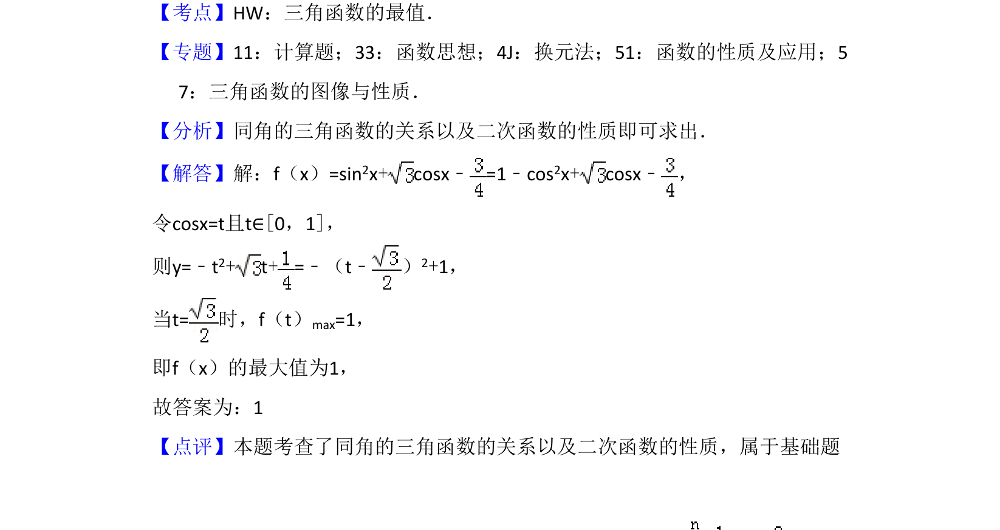

## 题面

## 摘要

考查利用同角三角函数关系转化为二次函数求最值。

## 关联考点

- [[三角函数的最值]]
- [[293-同角三角函数关系|同角三角函数关系]]
- [[换元法]]
- [[211-二次函数图象与性质|二次函数性质]]

## 答案与解析

> 📄 原 PDF 第 12 页：`素材/真题/吉林/2008-2024·（吉林）数学高考真题/2017年高考数学试卷（理）（新课标Ⅱ）（解析卷）.pdf`
