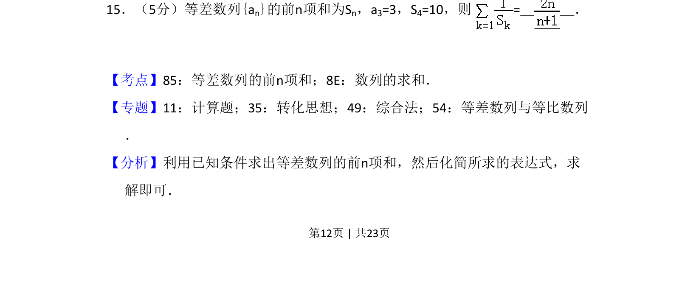
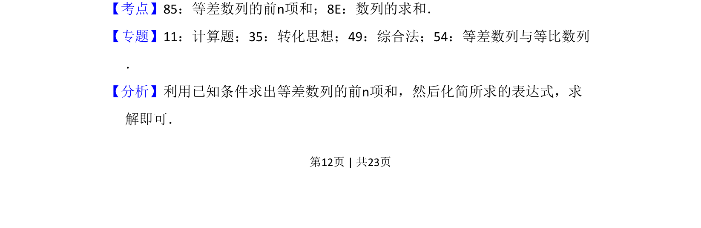
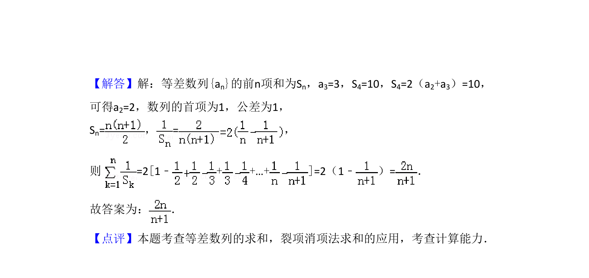

## 题面

## 摘要

已知等差数列的项与前n项和，求数列求和表达式的值

## 关联考点

- [[355-等差数列前n项和|等差数列的前n项和]]
- [[893-数列的求和|数列的求和]]
- [[412-等差数列性质|等差数列的性质]]

## 答案与解析

> 📄 原 PDF 第 12 页：`素材/真题/吉林/2008-2024·（吉林）数学高考真题/2017年高考数学试卷（理）（新课标Ⅱ）（解析卷）.pdf`

<!-- 题干文本-start -->
## 题干文本
15．（5分）等差数列{an}的前n项和为Sn，a3=3，S4=10，则 =　 　．
<!-- 题干文本-end -->

<!-- 解析文本-start -->
## 解析文本
【考点】85：等差数列的前n项和；8E：数列的求和．菁优网版权所有
【专题】11：计算题；35：转化思想；49：综合法；54：等差数列与等比数列
．
【分析】利用已知条件求出等差数列的前n项和，然后化简所求的表达式，求
解即可．
<!-- 解析文本-end -->
