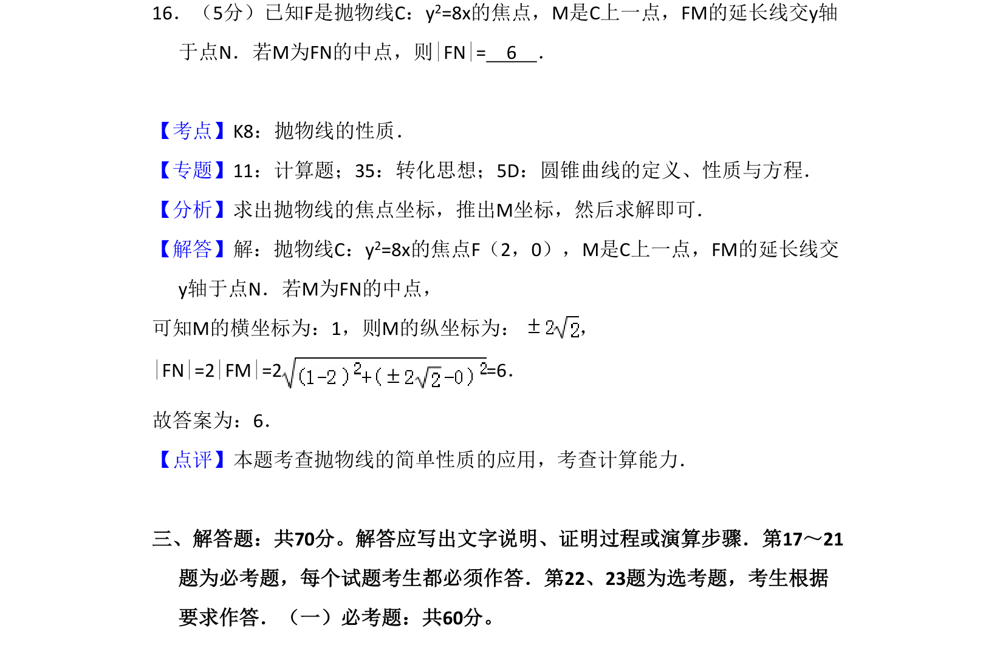
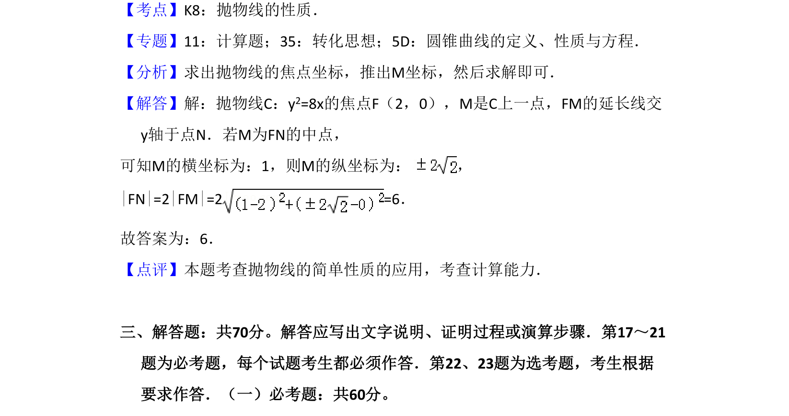

## 题面

## 摘要

抛物线y²=8x焦点F，M在抛物线上，FM延长线交y轴于N，M为FN中点，利用抛物线焦半径和中点条件求|FN|。

## 关联考点

- [[227-抛物线|抛物线]]
- [[1168-焦半径|焦半径]]
- [[636-中点条件|中点条件]]
- [[1111-解析几何|解析几何]]

## 答案与解析

> 📄 原 PDF 第 13 页：`素材/真题/吉林/2008-2024·（吉林）数学高考真题/2017年高考数学试卷（理）（新课标Ⅱ）（解析卷）.pdf`
