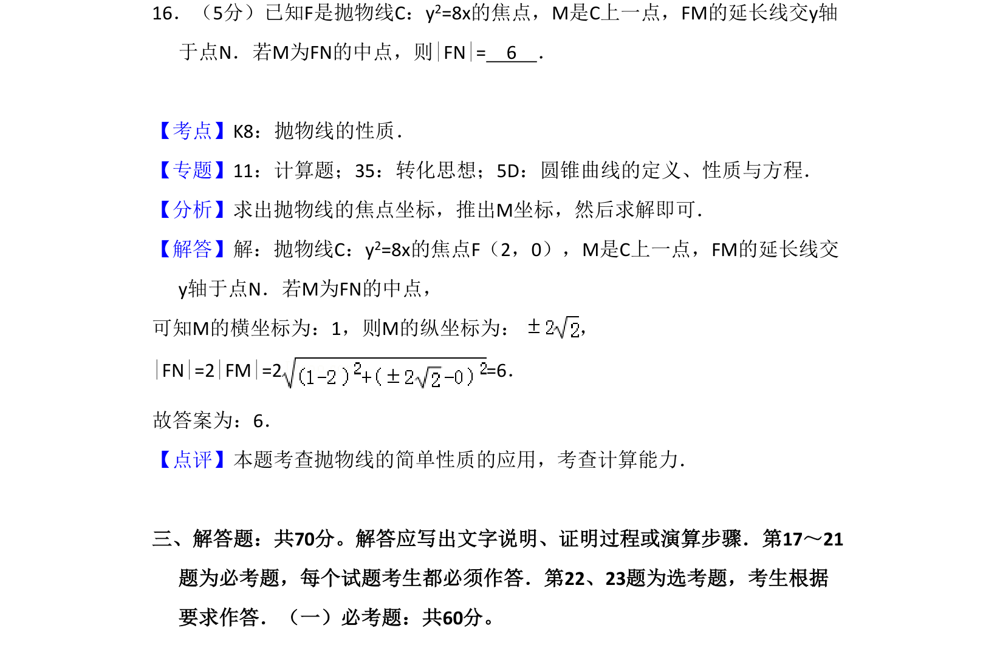
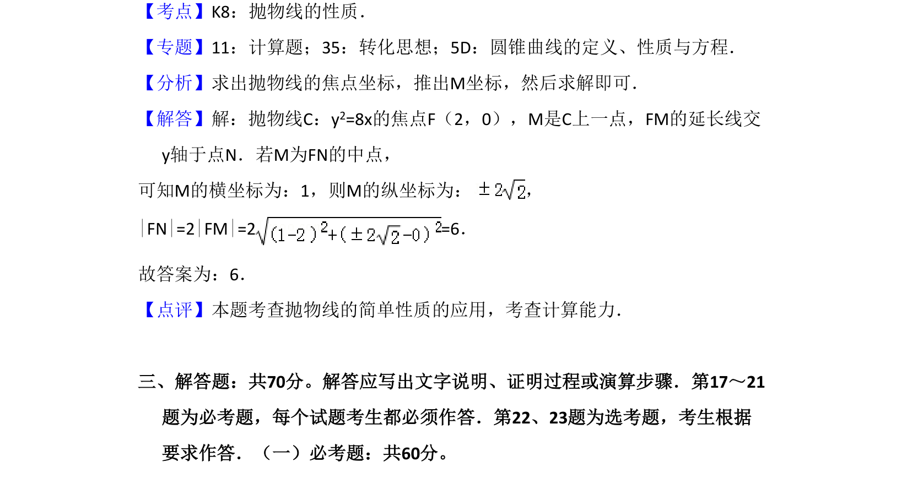

## 题面

## 摘要

抛物线y²=8x焦点F，M在抛物线上，FM延长线交y轴于N，M为FN中点，利用抛物线焦半径和中点条件求|FN|。

## 关联考点

- [[227-抛物线|抛物线]]
- [[1168-焦半径|焦半径]]
- [[636-中点条件|中点条件]]
- [[1111-解析几何|解析几何]]

## 答案与解析

> 📄 原 PDF 第 13 页：`素材/真题/吉林/2008-2024·（吉林）数学高考真题/2017年高考数学试卷（理）（新课标Ⅱ）（解析卷）.pdf`

<!-- 题干文本-start -->
## 题干文本
16．（5分）已知F是抛物线C：y2=8x的焦点，M是C上一点，FM的延长线交y轴
于点N．若M为FN的中点，则|FN|=　6　．
<!-- 题干文本-end -->

<!-- 解析文本-start -->
## 解析文本
【考点】K8：抛物线的性质．菁优网版权所有
【专题】11：计算题；35：转化思想；5D：圆锥曲线的定义、性质与方程．
【分析】求出抛物线的焦点坐标，推出M坐标，然后求解即可．
【解答】解：抛物线C：y2=8x的焦点F（2，0），M是C上一点，FM的延长线交
y轴于点N．若M为FN的中点，
可知M的横坐标为：1，则M的纵坐标为： ，
|FN|=2|FM|=2 =6．
故答案为：6．
【点评】本题考查抛物线的简单性质的应用，考查计算能力．
　
三、解答题：共70分。解答应写出文字说明、证明过程或演算步骤．第17～21
题为必考题，每个试题考生都必须作答．第22、23题为选考题，考生根据
要求作答．（一）必考题：共60分。
<!-- 解析文本-end -->
