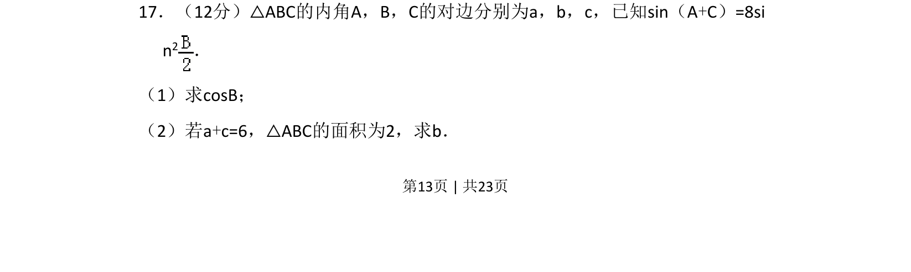
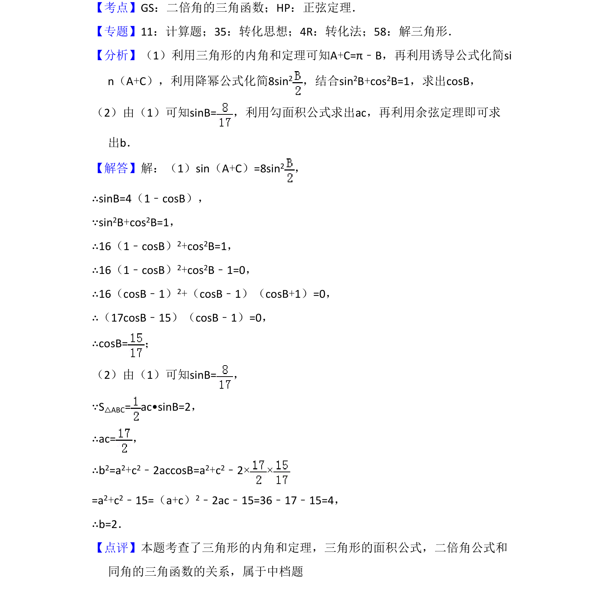

## 题面

## 摘要

该题考查三角形内角关系与三角恒等变换求角，再利用余弦定理及面积公式求边长。

## 关联考点

- [[272-三角恒等变换|三角恒等变换]]
- [[解三角形]]
- [[126-定理|余弦定理]]
- [[三角形面积公式]]

## 答案与解析

> 📄 原 PDF 第 13 页：`素材/真题/吉林/2008-2024·（吉林）数学高考真题/2017年高考数学试卷（理）（新课标Ⅱ）（解析卷）.pdf`
