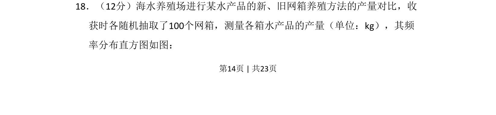

## 题面

## 摘要

本题通过频率分布直方图分析新旧网箱养殖方法的产量，考查数据估计与比较。

## 关联考点

- [[364-频率分布直方图|频率分布直方图]]
- [[344-用样本估计总体|用样本估计总体]]
- [[508-统计推断|统计推断]]

## 答案与解析

> 📄 原 PDF 第 14 页：`素材/真题/吉林/2008-2024·（吉林）数学高考真题/2017年高考数学试卷（理）（新课标Ⅱ）（解析卷）.pdf`
