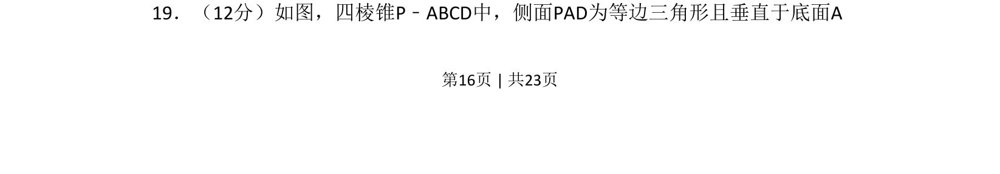

## 题面

## 摘要

四棱锥中给定面面垂直与等边三角形条件，考查空间位置关系的证明与空间角计算

## 关联考点

- [[立体几何]]
- [[351-空间直线平面垂直|面面垂直]]
- [[353-空间角|线面角]]
- [[401-空间向量基本概念|空间向量]]

## 答案与解析

> 📄 原 PDF 第 16 页：`素材/真题/吉林/2008-2024·（吉林）数学高考真题/2017年高考数学试卷（理）（新课标Ⅱ）（解析卷）.pdf`
