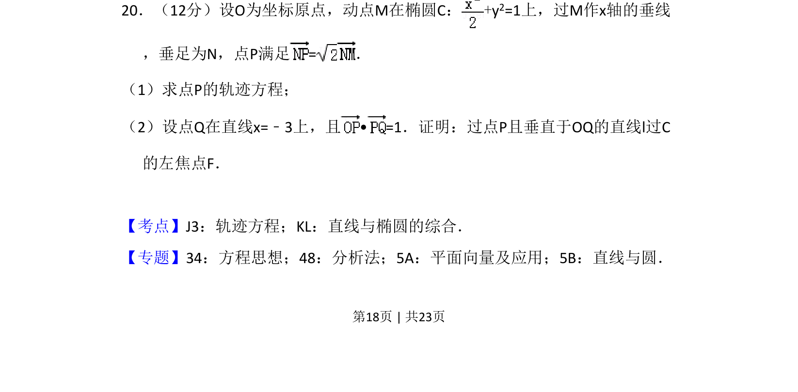
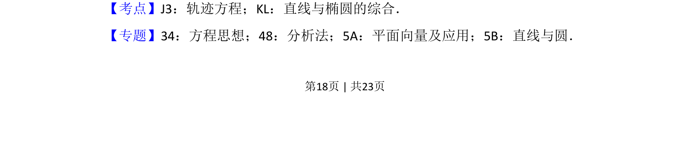
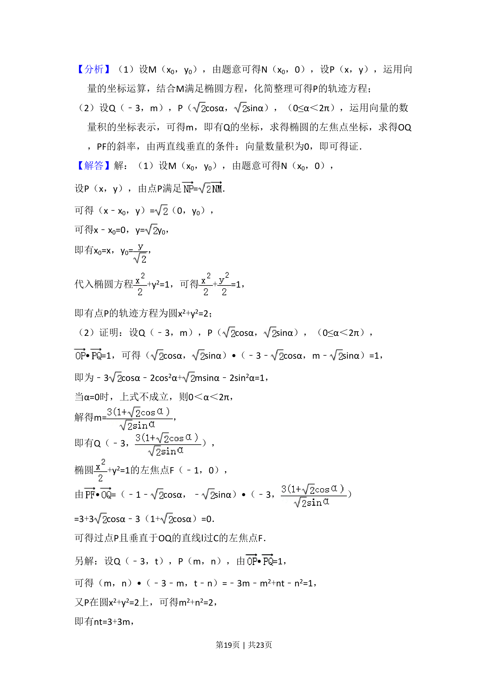
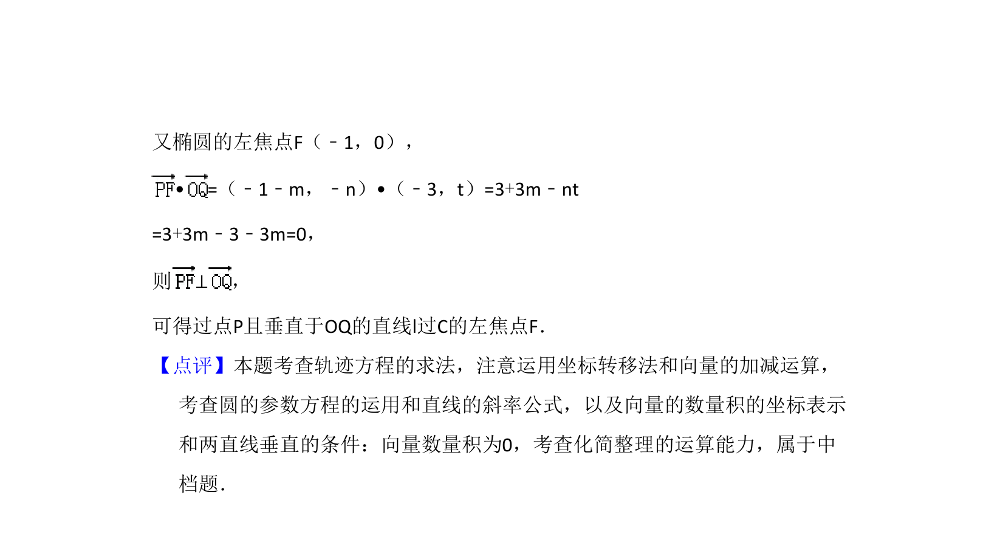

## 题面

## 摘要

第（1）问求点P的轨迹方程，第（2）问综合向量垂直与直线过定点证明。

## 关联考点

- [[376-圆锥曲线轨迹问题|轨迹方程]]
- [[575-直线与椭圆综合|直线与椭圆综合]]
- [[854-平面向量数量积|平面向量数量积]]

## 答案与解析

> 📄 原 PDF 第 18 页：`素材/真题/吉林/2008-2024·（吉林）数学高考真题/2017年高考数学试卷（理）（新课标Ⅱ）（解析卷）.pdf`
