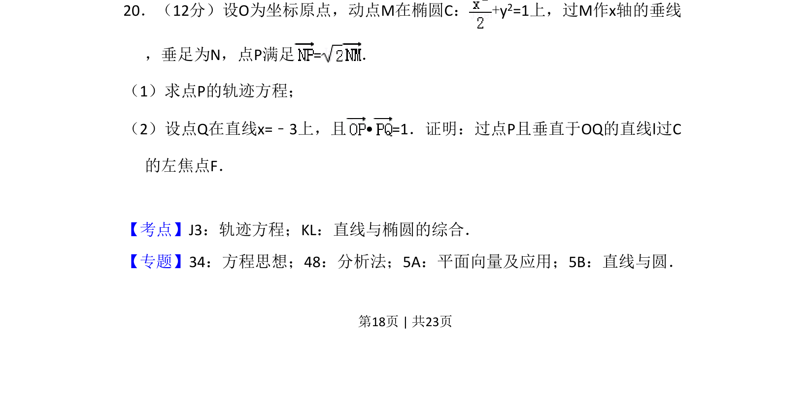
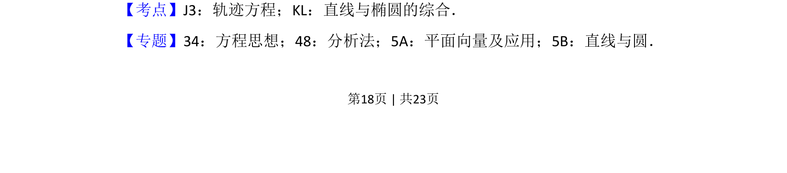
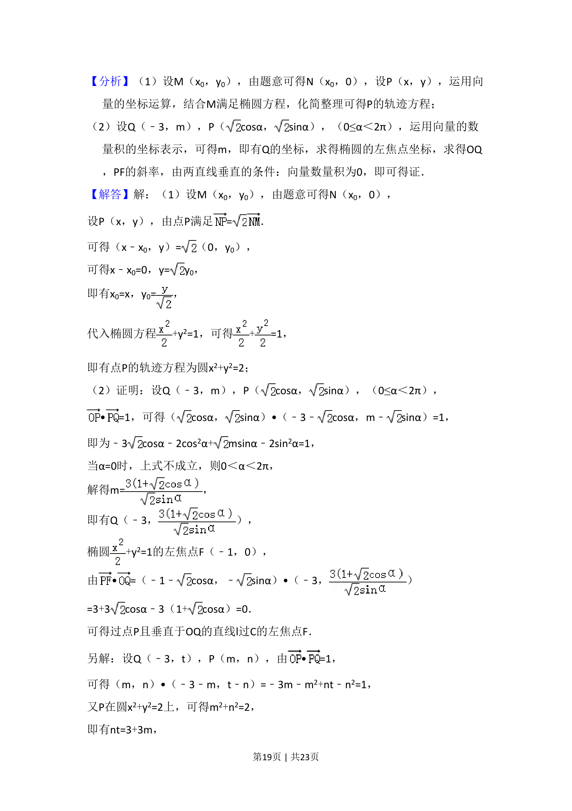
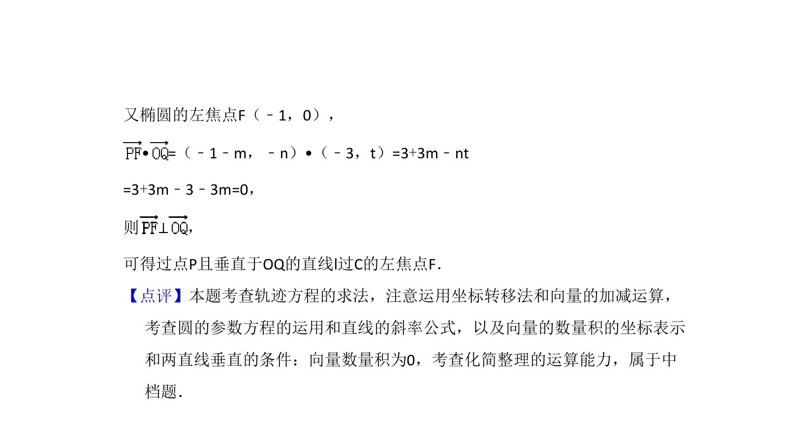

## 题面

## 摘要

第（1）问求点P的轨迹方程，第（2）问综合向量垂直与直线过定点证明。

## 关联考点

- [[376-圆锥曲线轨迹问题|轨迹方程]]
- [[575-直线与椭圆综合|直线与椭圆综合]]
- [[854-平面向量数量积|平面向量数量积]]

## 答案与解析

> 📄 原 PDF 第 18 页：`素材/真题/吉林/2008-2024·（吉林）数学高考真题/2017年高考数学试卷（理）（新课标Ⅱ）（解析卷）.pdf`

<!-- 题干文本-start -->
## 题干文本
20．（12分）设O为坐标原点，动点M在椭圆C：+y 2=1上，过M作x轴的垂线
，垂足为N，点P满足=．
（1）求点P的轨迹方程；
（2）设点Q在直线x=﹣3上，且• =1．证明：过点P且垂直于OQ的直线l过C
的左焦点F．
<!-- 题干文本-end -->

<!-- 解析文本-start -->
## 解析文本
【考点】J3：轨迹方程；KL：直线与椭圆的综合．菁优网版权所有
【专题】34：方程思想；48：分析法；5A：平面向量及应用；5B：直线与圆．
<!-- 解析文本-end -->
