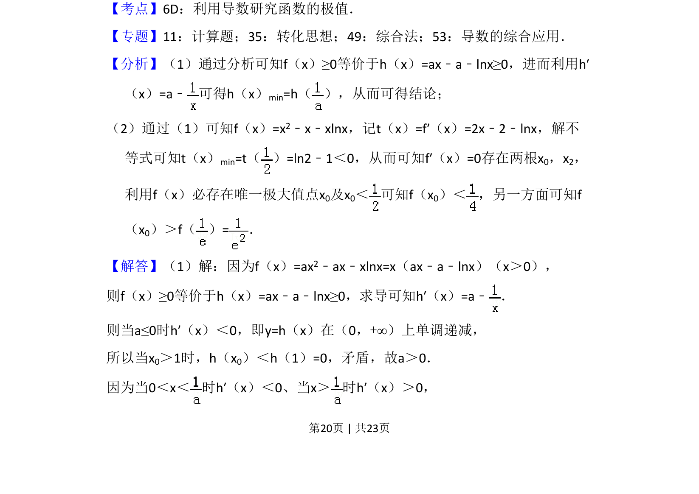

## 题面

## 摘要

本题通过导数研究含参函数恒成立问题，求参数并证明极值点的唯一性及不等式。

## 关联考点

- [[利用导数研究函数的极值]]
- [[288-函数零点|函数零点]]
- [[不等式证明]]

## 答案与解析

> 📄 原 PDF 第 20 页：`素材/真题/吉林/2008-2024·（吉林）数学高考真题/2017年高考数学试卷（理）（新课标Ⅱ）（解析卷）.pdf`
