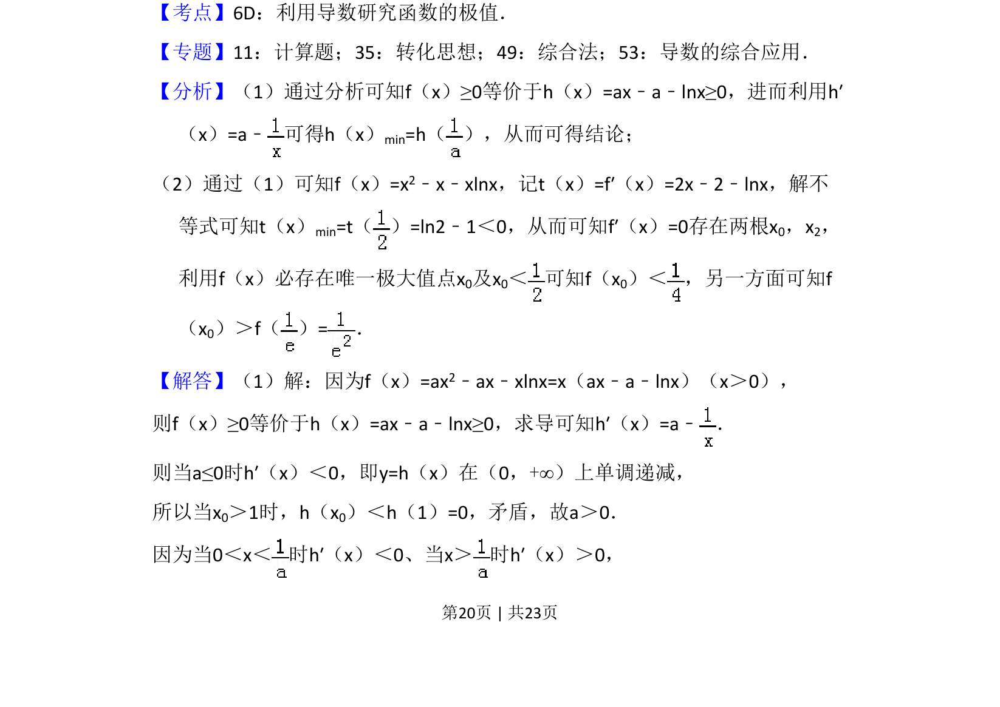
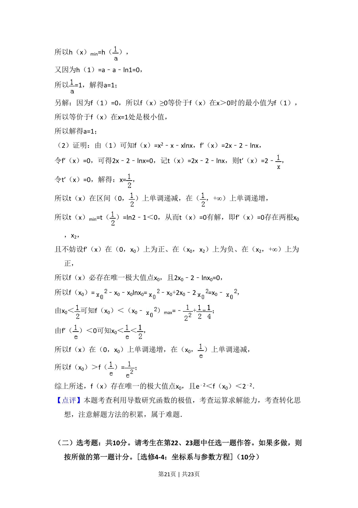

## 题面

## 摘要

本题通过导数研究含参函数恒成立问题，求参数并证明极值点的唯一性及不等式。

## 关联考点

- [[707-利用导数研究函数的极值|利用导数研究函数的极值]]
- [[288-函数零点|函数零点]]
- [[624-不等式的证明|不等式证明]]

## 答案与解析

> 📄 原 PDF 第 20 页：`素材/真题/吉林/2008-2024·（吉林）数学高考真题/2017年高考数学试卷（理）（新课标Ⅱ）（解析卷）.pdf`

<!-- 题干文本-start -->
## 题干文本
21．（12分）已知函数f（x）=ax2﹣ax﹣xlnx，且f（x）≥0．
（1）求a；
（2）证明：f（x）存在唯一的极大值点x0，且e﹣2＜f（x0）＜2﹣2．
<!-- 题干文本-end -->

<!-- 解析文本-start -->
## 解析文本
【考点】6D：利用导数研究函数的极值．菁优网版权所有
【专题】11：计算题；35：转化思想；49：综合法；53：导数的综合应用．
【分析】（1）通过分析可知f（x）≥0等价于h（x）=ax﹣a﹣lnx≥0，进而利用h′
（x）=a﹣ 可得h（x） min=h（ ），从而可得结论；
（2）通过（1）可知f（x）=x2﹣x﹣xlnx，记t（x）=f′（x）=2x﹣2﹣lnx，解不
等式可知t（x）min=t（ ）=ln2﹣1＜0，从而可知f′（x）=0存在两根x 0，x2，
利用f（x）必存在唯一极大值点x0及x0＜ 可知f（x 0）＜ ，另一方面可知f
（x0）＞f（ ）=．
【解答】（1）解：因为f（x）=ax2﹣ax﹣xlnx=x（ax﹣a﹣lnx）（x＞0），
则f（x）≥0等价于h（x）=ax﹣a﹣lnx≥0，求导可知h′（x）=a﹣ ．
则当a≤0时h′（x）＜0，即y=h（x）在（0，+∞）上单调递减，
所以当x0＞1时，h（x0）＜h（1）=0，矛盾，故a＞0．
因为当0＜x＜ 时h′（x）＜0、当x＞ 时h′（x）＞0，
<!-- 解析文本-end -->
