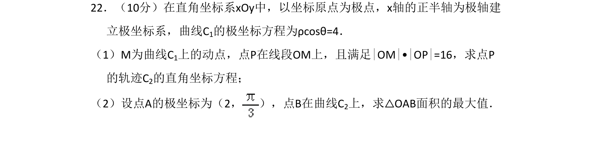
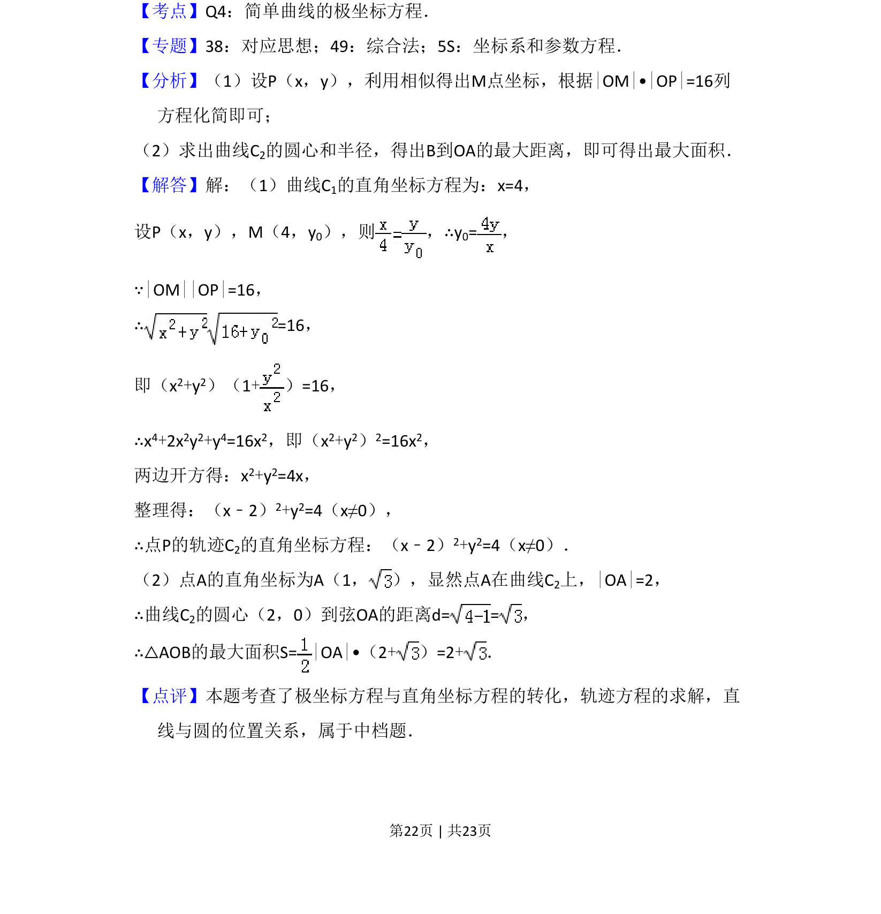
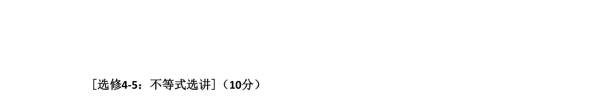

## 题面

## 摘要

本题将极坐标方程转化为直角坐标方程，求动点轨迹及三角形面积最大值。

## 关联考点

- [[922-极坐标方程|极坐标方程]]
- [[376-圆锥曲线轨迹问题|轨迹方程]]
- [[394-直线和圆位置关系-高中|直线与圆的位置关系]]

## 答案与解析

> 📄 原 PDF 第 22 页：`素材/真题/吉林/2008-2024·（吉林）数学高考真题/2017年高考数学试卷（理）（新课标Ⅱ）（解析卷）.pdf`
