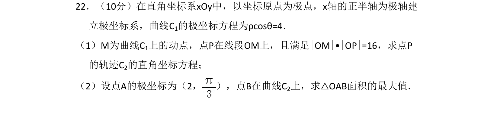
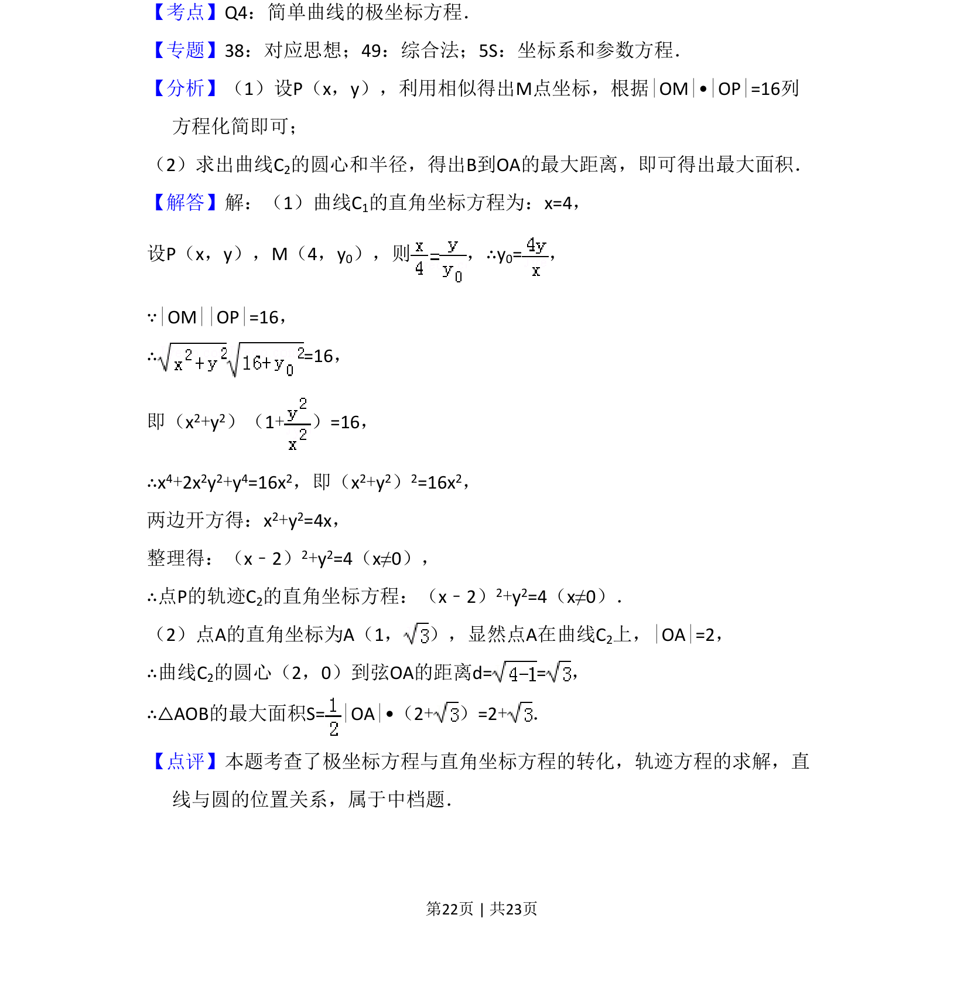
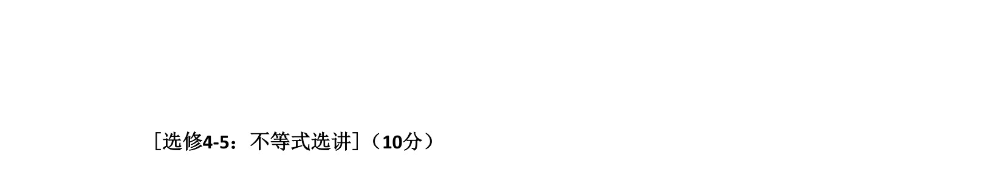

## 题面

## 摘要

本题将极坐标方程转化为直角坐标方程，求动点轨迹及三角形面积最大值。

## 关联考点

- [[921-极坐标方程|极坐标方程]]
- [[376-圆锥曲线轨迹问题|轨迹方程]]
- [[394-直线和圆位置关系-高中|直线与圆的位置关系]]

## 答案与解析

> 📄 原 PDF 第 22 页：`素材/真题/吉林/2008-2024·（吉林）数学高考真题/2017年高考数学试卷（理）（新课标Ⅱ）（解析卷）.pdf`

<!-- 题干文本-start -->
## 题干文本
22．（10分）在直角坐标系xOy中，以坐标原点为极点，x轴的正半轴为极轴建
立极坐标系，曲线C1的极坐标方程为ρcosθ=4．
（1）M为曲线C1上的动点，点P在线段OM上，且满足|OM|•|OP|=16，求点P
的轨迹C2的直角坐标方程；
（2）设点A的极坐标为（2， ），点B在曲线C 2上，求△OAB面积的最大值．
<!-- 题干文本-end -->

<!-- 解析文本-start -->
## 解析文本
【考点】Q4：简单曲线的极坐标方程．菁优网版权所有
【专题】38：对应思想；49：综合法；5S：坐标系和参数方程．
【分析】（1）设P（x，y），利用相似得出M点坐标，根据|OM|•|OP|=16列
方程化简即可；
（2）求出曲线C2的圆心和半径，得出B到OA的最大距离，即可得出最大面积．
【解答】解：（1）曲线C1的直角坐标方程为：x=4，
设P（x，y），M（4，y0），则 ，∴y 0=，
∵|OM||OP|=16，
∴=16，
即（x2+y2）（1+）=16，
∴x4+2x2y2+y4=16x2，即（x2+y2）2=16x2，
两边开方得：x2+y2=4x，
整理得：（x﹣2）2+y2=4（x≠0），
∴点P的轨迹C2的直角坐标方程：（x﹣2）2+y2=4（x≠0）．
（2）点A的直角坐标为A（1， ），显然点A在曲线C 2上，|OA|=2，
∴曲线C2的圆心（2，0）到弦OA的距离d= =，
∴△AOB的最大面积S=|OA|•（2+）=2+．
【点评】本题考查了极坐标方程与直角坐标方程的转化，轨迹方程的求解，直
线与圆的位置关系，属于中档题．
<!-- 解析文本-end -->
