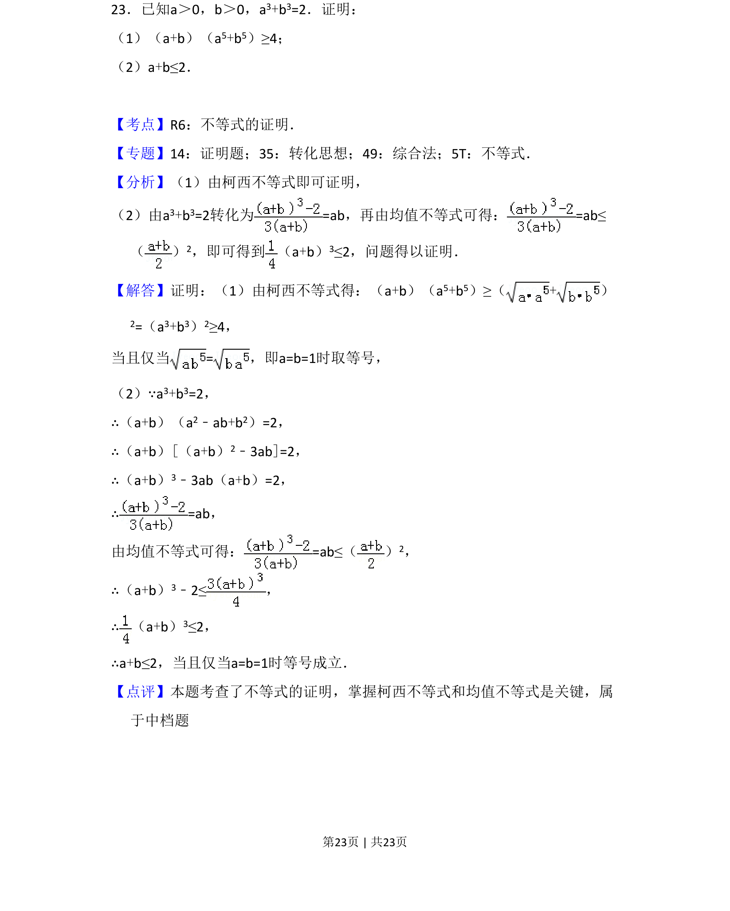
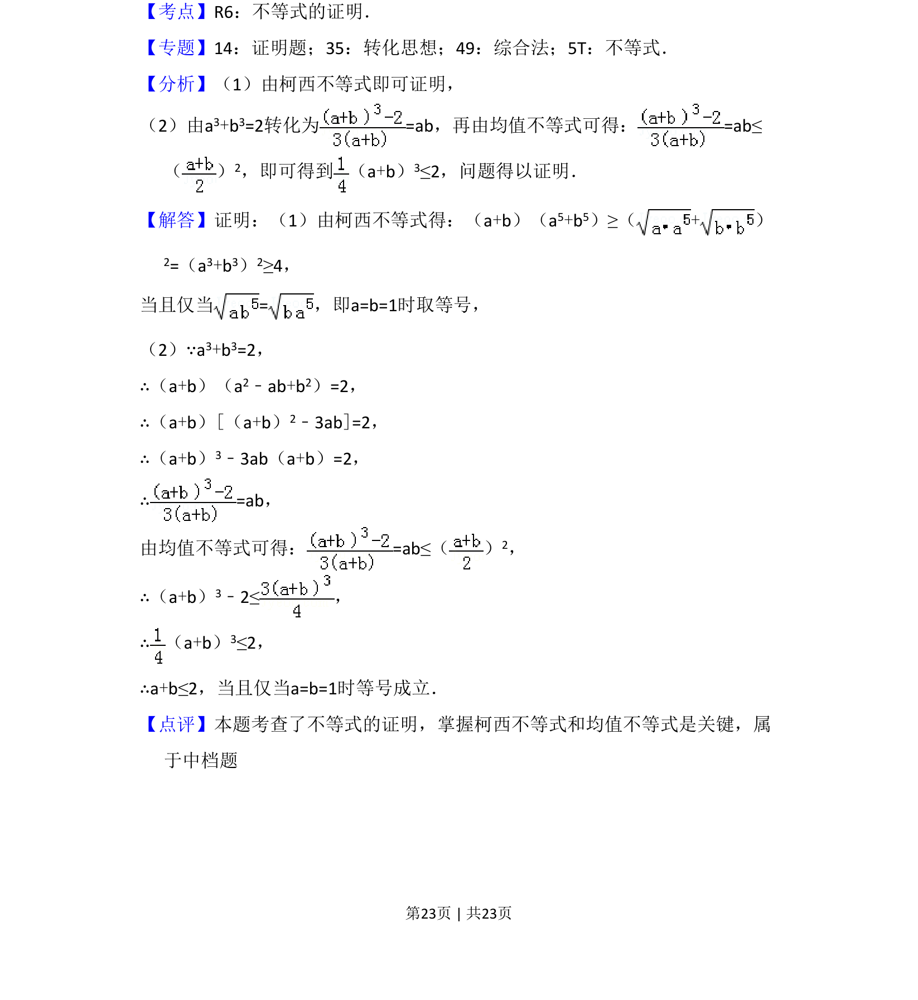

## 题面

## 摘要

该题考查利用柯西不等式和均值不等式证明不等式，涉及代数变形与等号条件。

## 关联考点

- [[624-不等式的证明|不等式的证明]]
- [[927-柯西不等式|柯西不等式]]
- [[295-基本不等式|均值不等式]]

## 答案与解析

> 📄 原 PDF 第 23 页：`素材/真题/吉林/2008-2024·（吉林）数学高考真题/2017年高考数学试卷（理）（新课标Ⅱ）（解析卷）.pdf`
