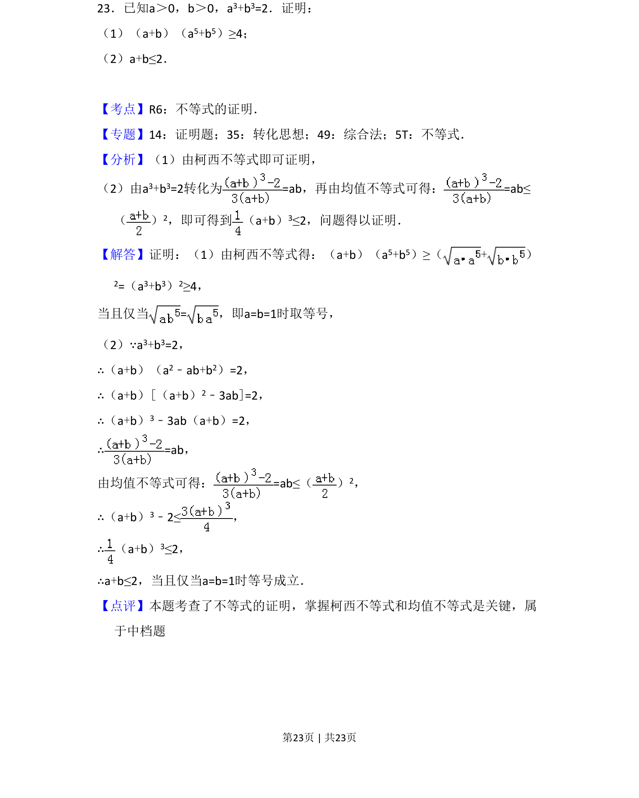
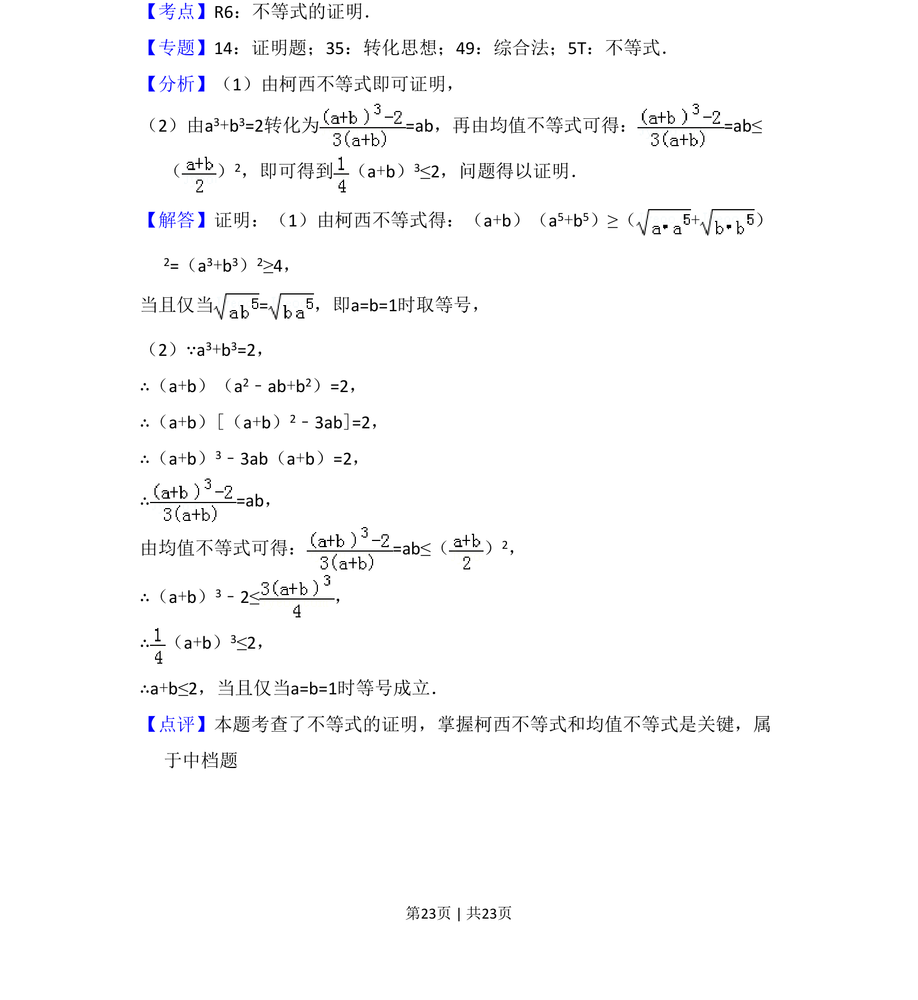

## 题面

## 摘要

该题考查利用柯西不等式和均值不等式证明不等式，涉及代数变形与等号条件。

## 关联考点

- [[624-不等式的证明|不等式的证明]]
- [[927-柯西不等式|柯西不等式]]
- [[295-基本不等式|均值不等式]]

## 答案与解析

> 📄 原 PDF 第 23 页：`素材/真题/吉林/2008-2024·（吉林）数学高考真题/2017年高考数学试卷（理）（新课标Ⅱ）（解析卷）.pdf`

<!-- 题干文本-start -->
## 题干文本
23．已知a＞0，b＞0，a3+b3=2．证明：
（1）（a+b）（a5+b5）≥4；
（2）a+b≤2．
<!-- 题干文本-end -->

<!-- 解析文本-start -->
## 解析文本
【考点】R6：不等式的证明．菁优网版权所有
【专题】14：证明题；35：转化思想；49：综合法；5T：不等式．
【分析】（1）由柯西不等式即可证明，
（2）由a3+b3=2转化为=ab，再由均值不等式可得：=ab≤
（ ） 2，即可得到 （a+b） 3≤2，问题得以证明．
【解答】证明：（1）由柯西不等式得：（a+b）（a5+b5）≥（+）
2=（a3+b3）2≥4，
当且仅当=，即a=b=1时取等号，
（2）∵a3+b3=2，
∴（a+b）（a2﹣ab+b2）=2，
∴（a+b）[（a+b）2﹣3ab]=2，
∴（a+b）3﹣3ab（a+b）=2，
∴=ab，
由均值不等式可得：=ab≤（ ） 2，
∴（a+b）3﹣2≤，
∴（a+b） 3≤2，
∴a+b≤2，当且仅当a=b=1时等号成立．
【点评】本题考查了不等式的证明，掌握柯西不等式和均值不等式是关键，属
于中档题
<!-- 解析文本-end -->
