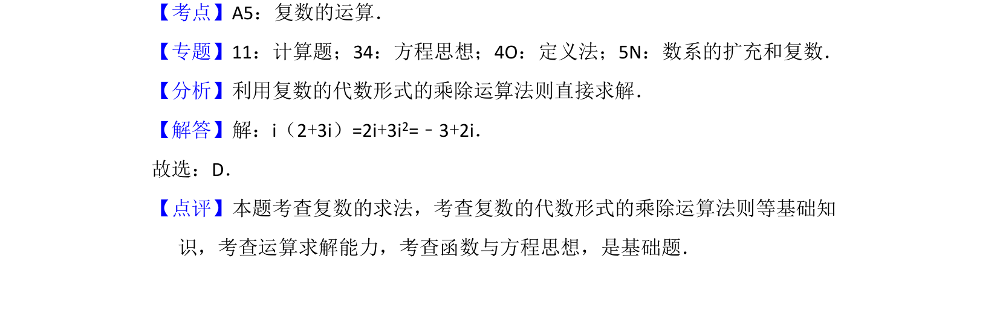

## 题面

## 摘要

本题主要考查复数的代数形式乘法运算，通过直接计算求解。

## 关联考点

- [[811-复数运算|复数运算]]
- [[332-复数的乘除运算|复数乘法]]

## 答案与解析

> 📄 原 PDF 第 1 页：`素材/真题/吉林/2008-2024·（吉林）数学高考真题/2018年高考数学试卷（文）（新课标Ⅱ）（解析卷）.pdf`

<!-- 题干文本-start -->
## 题干文本
1．（5分）i（2+3i）=（　　）
A．3﹣2i B．3+2i C．﹣3﹣2i D．﹣3+2i
<!-- 题干文本-end -->

<!-- 解析文本-start -->
## 解析文本
【考点】A5：复数的运算．菁优网版权所有
【专题】11：计算题；34：方程思想；4O：定义法；5N：数系的扩充和复数．
【分析】利用复数的代数形式的乘除运算法则直接求解．
【解答】解：i（2+3i）=2i+3i2=﹣3+2i．
故选：D．
【点评】本题考查复数的求法，考查复数的代数形式的乘除运算法则等基础知
识，考查运算求解能力，考查函数与方程思想，是基础题．
<!-- 解析文本-end -->
