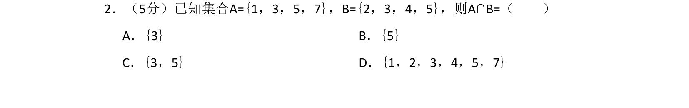
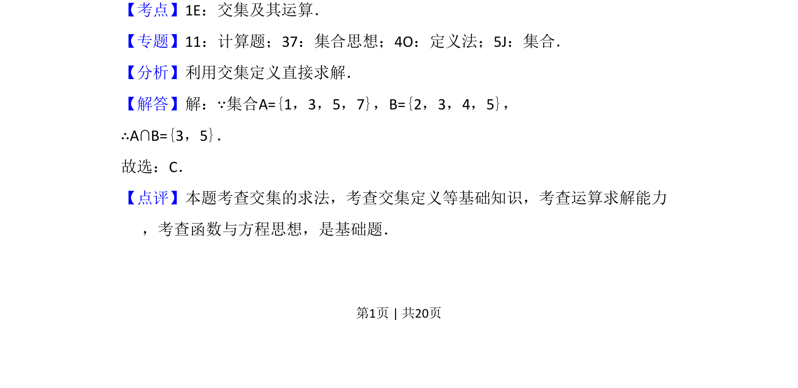

## 题面

## 摘要

求两个有限集合的交集

## 关联考点

- [[042-集合|集合]]
- [[646-交集运算|交集运算]]

## 答案与解析

> 📄 原 PDF 第 1 页：`素材/真题/吉林/2008-2024·（吉林）数学高考真题/2018年高考数学试卷（文）（新课标Ⅱ）（解析卷）.pdf`

<!-- 题干文本-start -->
## 题干文本
2．（5分）已知集合A={1，3，5，7}，B={2，3，4，5}，则A∩B=（　　）
A．{3}B．{5}
C．{3，5}D．{1，2，3，4，5，7}
<!-- 题干文本-end -->

<!-- 解析文本-start -->
## 解析文本
【考点】1E：交集及其运算．菁优网版权所有
【专题】11：计算题；37：集合思想；4O：定义法；5J：集合．
【分析】利用交集定义直接求解．
【解答】解：∵集合A={1，3，5，7}，B={2，3，4，5}，
∴A∩B={3，5}．
故选：C．
【点评】本题考查交集的求法，考查交集定义等基础知识，考查运算求解能力
，考查函数与方程思想，是基础题．
<!-- 解析文本-end -->
