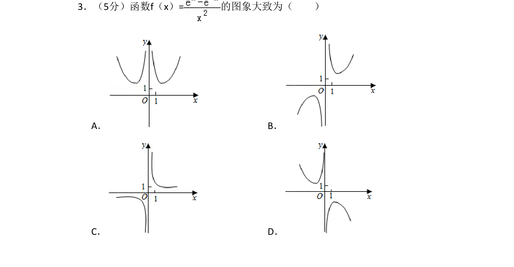
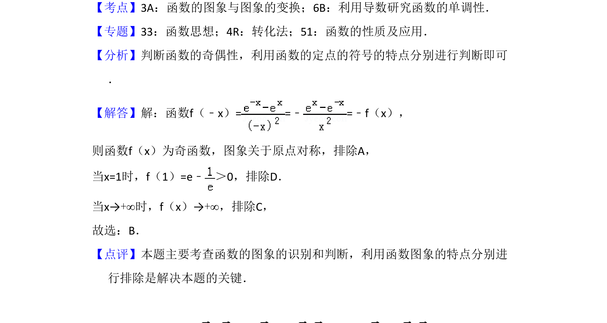

## 题面

## 摘要

判断函数f(x)=(e^x-e^{-x})/x²的大致图象，利用奇函数性质及函数图象特征进行识别。

## 关联考点

- [[284-函数的奇偶性|奇函数]]
- [[678-函数图象识别|函数图象识别]]

## 答案与解析

> 📄 原 PDF 第 2 页：`素材/真题/吉林/2008-2024·（吉林）数学高考真题/2018年高考数学试卷（文）（新课标Ⅱ）（解析卷）.pdf`

<!-- 题干文本-start -->
## 题干文本
3．（5分）函数f（x）=的图象大致为（　　）
A．B．
C．D．
<!-- 题干文本-end -->

<!-- 解析文本-start -->
## 解析文本
【考点】3A：函数的图象与图象的变换；6B：利用导数研究函数的单调性．菁优网版权所有
【专题】33：函数思想；4R：转化法；51：函数的性质及应用．
【分析】判断函数的奇偶性，利用函数的定点的符号的特点分别进行判断即可
．
【解答】解：函数f（﹣x）= =﹣=﹣f（x），
则函数f（x）为奇函数，图象关于原点对称，排除A，
当x=1时，f（1）=e﹣ ＞0，排除D．
当x→+∞时，f（x）→+∞，排除C，
故选：B．
【点评】本题主要考查函数的图象的识别和判断，利用函数图象的特点分别进
行排除是解决本题的关键．
<!-- 解析文本-end -->
