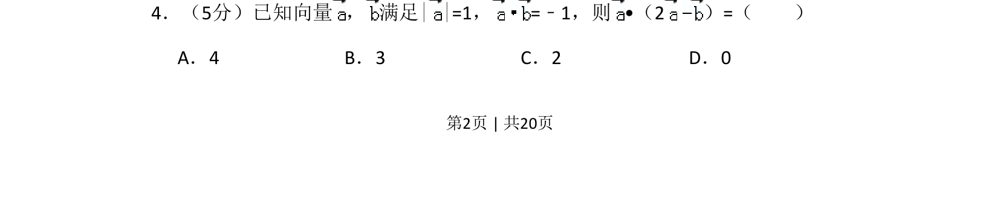
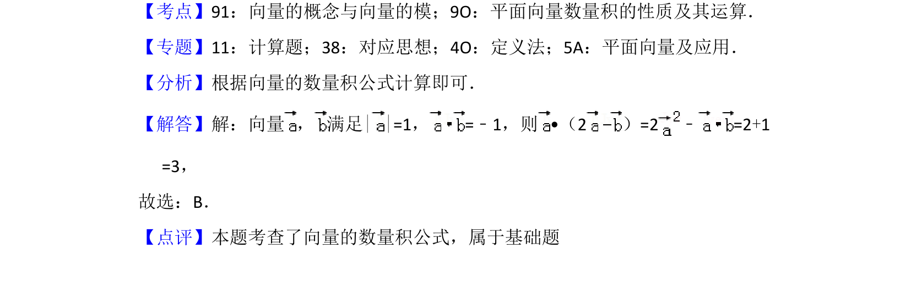

## 题面

## 摘要

向量模长与数量积运算，利用运算律直接计算。

## 关联考点

- [[752-向量模长|向量的模]]
- [[328-向量的数量积|向量的数量积]]
- [[052-运算律|运算律]]

## 答案与解析

> 📄 原 PDF 第 2 页：`素材/真题/吉林/2008-2024·（吉林）数学高考真题/2018年高考数学试卷（文）（新课标Ⅱ）（解析卷）.pdf`
