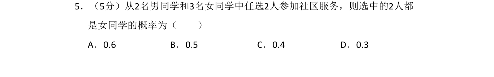
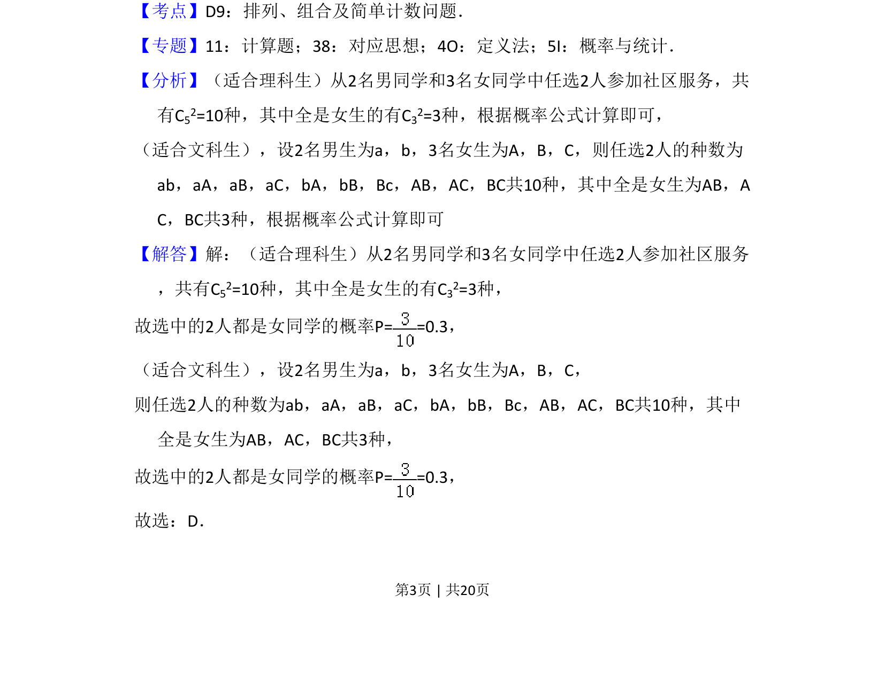
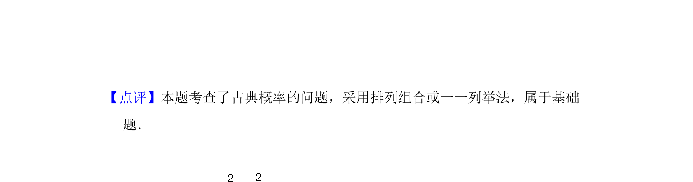

## 题面

## 摘要

从2名男生和3名女生中选2人，求均为女生的概率，考查古典概型计算。

## 关联考点

- [[320-古典概型|古典概型]]
- [[1090-组合计数|组合计数]]

## 答案与解析

> 📄 原 PDF 第 3 页：`素材/真题/吉林/2008-2024·（吉林）数学高考真题/2018年高考数学试卷（文）（新课标Ⅱ）（解析卷）.pdf`

<!-- 题干文本-start -->
## 题干文本
5．（5分）从2名男同学和3名女同学中任选2人参加社区服务，则选中的2人都
是女同学的概率为（　　）
A．0.6 B．0.5 C．0.4 D．0.3
<!-- 题干文本-end -->

<!-- 解析文本-start -->
## 解析文本
【考点】D9：排列、组合及简单计数问题．菁优网版权所有
【专题】11：计算题；38：对应思想；4O：定义法；5I：概率与统计．
【分析】（适合理科生）从2名男同学和3名女同学中任选2人参加社区服务，共
有C52=10种，其中全是女生的有C32=3种，根据概率公式计算即可，
（适合文科生），设2名男生为a，b，3名女生为A，B，C，则任选2人的种数为
ab，aA，aB，aC，bA，bB，Bc，AB，AC，BC共10种，其中全是女生为AB，A
C，BC共3种，根据概率公式计算即可
【解答】解：（适合理科生）从2名男同学和3名女同学中任选2人参加社区服务
，共有C52=10种，其中全是女生的有C32=3种，
故选中的2人都是女同学的概率P= =0.3，
（适合文科生），设2名男生为a，b，3名女生为A，B，C，
则任选2人的种数为ab，aA，aB，aC，bA，bB，Bc，AB，AC，BC共10种，其中
全是女生为AB，AC，BC共3种，
故选中的2人都是女同学的概率P= =0.3，
故选：D．
<!-- 解析文本-end -->
