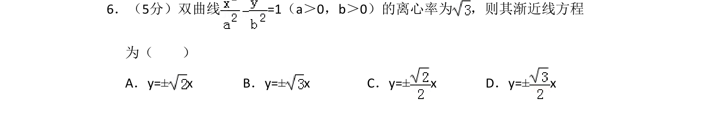
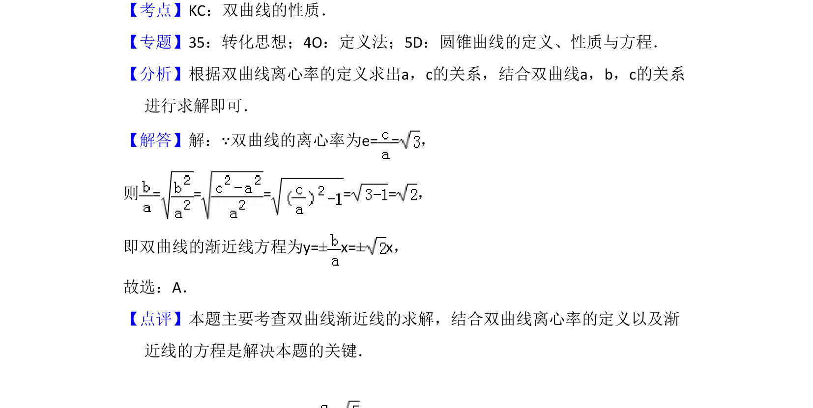

## 题面

## 摘要

已知双曲线离心率，求其渐近线方程。

## 关联考点

- [[731-双曲线的性质|双曲线的性质]]
- [[391-椭圆离心率|离心率]]
- [[369-双曲线渐近线|渐近线]]

## 答案与解析

> 📄 原 PDF 第 4 页：`素材/真题/吉林/2008-2024·（吉林）数学高考真题/2018年高考数学试卷（文）（新课标Ⅱ）（解析卷）.pdf`

<!-- 题干文本-start -->
## 题干文本
6．（5分）双曲线=1（a＞0，b＞0）的离心率为 ，则其渐近线方程
为（　　）
A．y=±x B．y=±x C．y=±x D．y=±x
<!-- 题干文本-end -->

<!-- 解析文本-start -->
## 解析文本
【考点】KC：双曲线的性质．菁优网版权所有
【专题】35：转化思想；4O：定义法；5D：圆锥曲线的定义、性质与方程．
【分析】根据双曲线离心率的定义求出a，c的关系，结合双曲线a，b，c的关系
进行求解即可．
【解答】解：∵双曲线的离心率为e= =，
则= = = = =，
即双曲线的渐近线方程为y=±x=±x，
故选：A．
【点评】本题主要考查双曲线渐近线的求解，结合双曲线离心率的定义以及渐
近线的方程是解决本题的关键．
<!-- 解析文本-end -->
