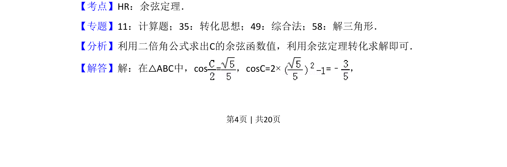
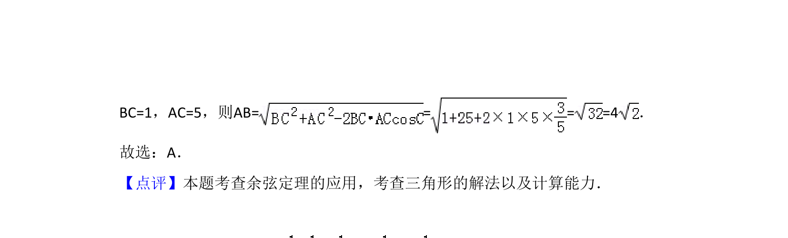

## 题面

## 摘要

已知两边及半角余弦值，通过二倍角公式求角C余弦，再应用余弦定理求第三边。

## 关联考点

- [[637-二倍角公式|二倍角公式]]
- [[126-定理|余弦定理]]
- [[589-解三角形|解三角形]]

## 答案与解析

> 📄 原 PDF 第 4 页：`素材/真题/吉林/2008-2024·（吉林）数学高考真题/2018年高考数学试卷（文）（新课标Ⅱ）（解析卷）.pdf`

<!-- 题干文本-start -->
## 题干文本
7．（5分）在△ABC中，cos =，BC=1，AC=5，则AB=（　　）
A．4 B．C．D．2
<!-- 题干文本-end -->

<!-- 解析文本-start -->
## 解析文本
【考点】HR：余弦定理．菁优网版权所有
【专题】11：计算题；35：转化思想；49：综合法；58：解三角形．
【分析】利用二倍角公式求出C的余弦函数值，利用余弦定理转化求解即可．
【解答】解：在△ABC中，cos =，cosC=2×=﹣ ，
<!-- 解析文本-end -->
