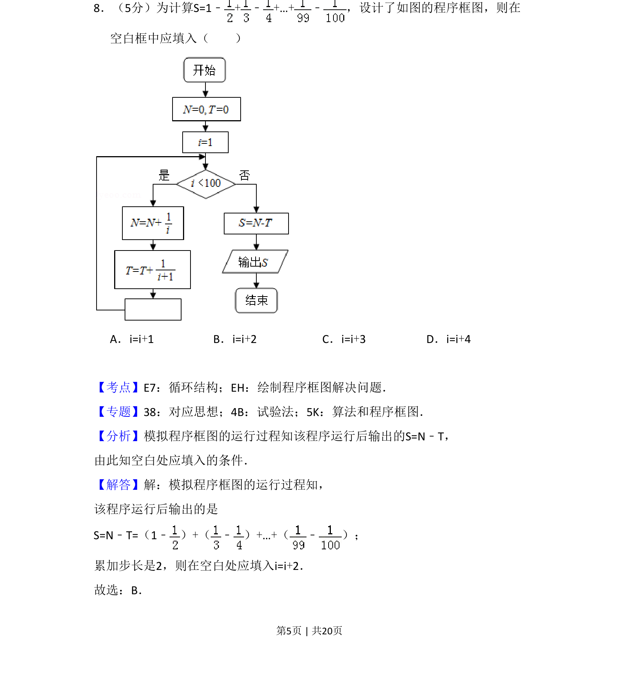
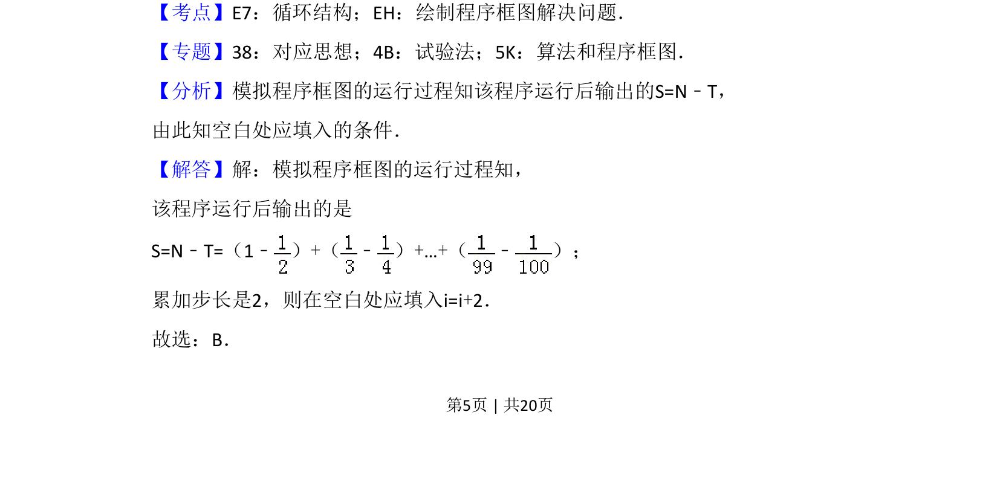
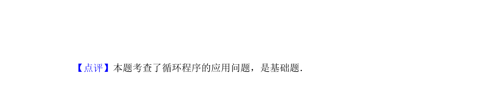

## 题面

## 摘要

该题考查程序框图中循环结构的执行逻辑，要求根据累加式确定循环步长。

## 关联考点

- [[870-循环结构|循环结构]]
- [[1042-程序框图|程序框图]]
- [[969-步长控制|步长控制]]

## 答案与解析

> 📄 原 PDF 第 5 页：`素材/真题/吉林/2008-2024·（吉林）数学高考真题/2018年高考数学试卷（文）（新课标Ⅱ）（解析卷）.pdf`

<!-- 题干文本-start -->
## 题干文本
8．（5分）为计算S=1﹣+﹣+…+﹣ ，设计了如图的程序框图，则在
空白框中应填入（　　）
A．i=i+1 B．i=i+2 C．i=i+3 D．i=i+4
<!-- 题干文本-end -->

<!-- 解析文本-start -->
## 解析文本
【考点】E7：循环结构；EH：绘制程序框图解决问题．菁优网版权所有
【专题】38：对应思想；4B：试验法；5K：算法和程序框图．
【分析】模拟程序框图的运行过程知该程序运行后输出的S=N﹣T，
由此知空白处应填入的条件．
【解答】解：模拟程序框图的运行过程知，
该程序运行后输出的是
S=N﹣T=（1﹣ ）+（ ﹣ ）+…+（ ﹣ ）；
累加步长是2，则在空白处应填入i=i+2．
故选：B．
<!-- 解析文本-end -->
