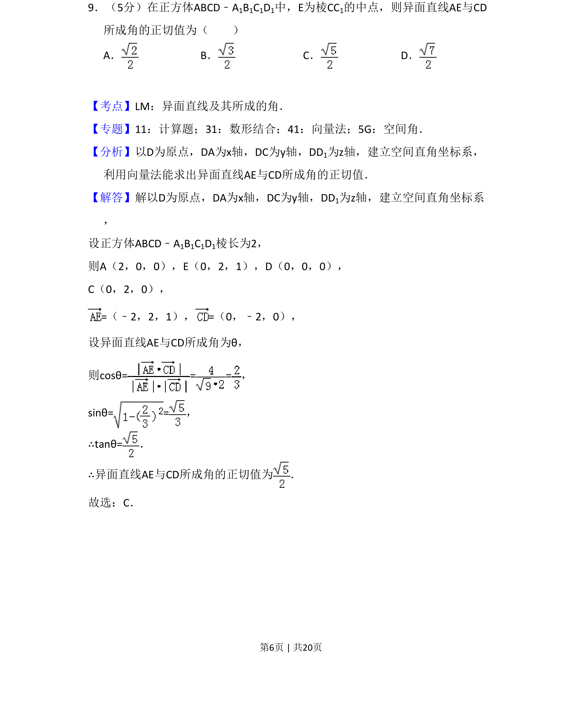

## 题面

## 摘要

在正方体中建立空间直角坐标系，利用向量法求异面直线所成角的正切值

## 关联考点

- [[异面直线及其所成的角]]
- [[399-空间向量坐标表示|空间直角坐标系]]
- [[向量法求空间角]]

## 答案与解析

> 📄 原 PDF 第 6 页：`素材/真题/吉林/2008-2024·（吉林）数学高考真题/2018年高考数学试卷（文）（新课标Ⅱ）（解析卷）.pdf`
