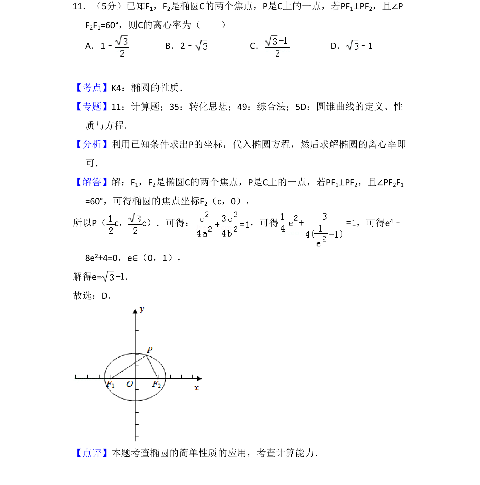
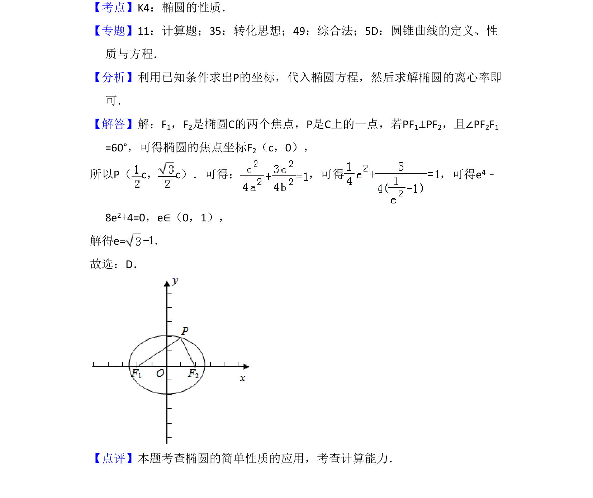

## 题面

## 摘要

根据椭圆焦点和垂直条件建立方程求解离心率。

## 关联考点

- [[388-椭圆几何性质|椭圆性质]]
- [[391-椭圆离心率|离心率]]
- [[037-焦点焦距|焦点]]
- [[545-垂直关系|垂直关系]]

## 答案与解析

> 📄 原 PDF 第 8 页：`素材/真题/吉林/2008-2024·（吉林）数学高考真题/2018年高考数学试卷（文）（新课标Ⅱ）（解析卷）.pdf`

<!-- 题干文本-start -->
## 题干文本
11．（5分）已知F1，F2是椭圆C的两个焦点，P是C上的一点，若PF1⊥PF2，且∠P
F2F1=60°，则C的离心率为（　　）
A．1﹣B．2﹣C．D． ﹣1
<!-- 题干文本-end -->

<!-- 解析文本-start -->
## 解析文本
【考点】K4：椭圆的性质．菁优网版权所有
【专题】11：计算题；35：转化思想；49：综合法；5D：圆锥曲线的定义、性
质与方程．
【分析】利用已知条件求出P的坐标，代入椭圆方程，然后求解椭圆的离心率即
可．
【解答】解：F1，F2是椭圆C的两个焦点，P是C上的一点，若PF1⊥PF2，且∠PF2F1
=60°，可得椭圆的焦点坐标F2（c，0），
所以P（c，c）．可得： ，可得 ，可得e 4﹣
8e2+4=0，e∈（0，1），
解得e=．
故选：D．
【点评】本题考查椭圆的简单性质的应用，考查计算能力．
<!-- 解析文本-end -->
