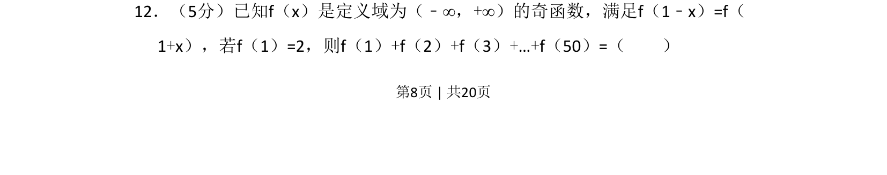
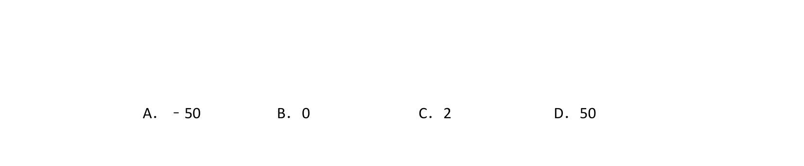
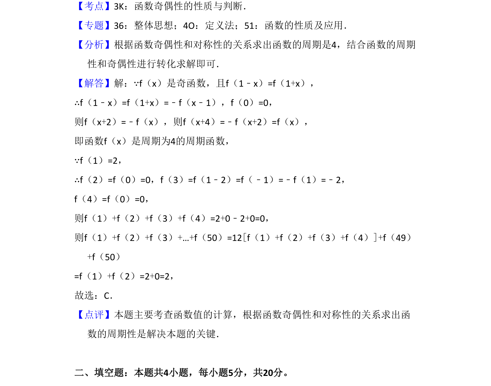

## 题面

## 摘要

该题考查利用奇函数和对称性推导函数的周期性，并求多个函数值之和。

## 关联考点

- [[820-奇函数性质|奇函数性质]]
- [[681-函数对称性|函数对称性]]
- [[761-周期性|周期性]]

## 答案与解析

> 📄 原 PDF 第 8 页：`素材/真题/吉林/2008-2024·（吉林）数学高考真题/2018年高考数学试卷（文）（新课标Ⅱ）（解析卷）.pdf`
