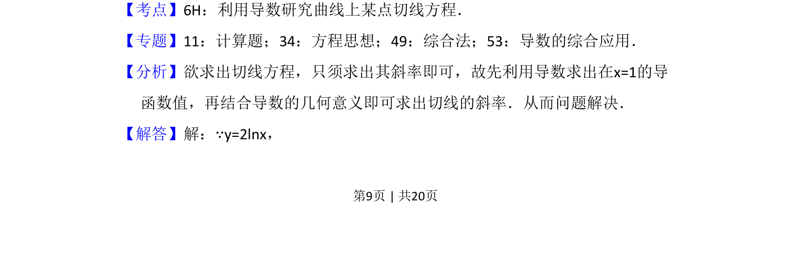
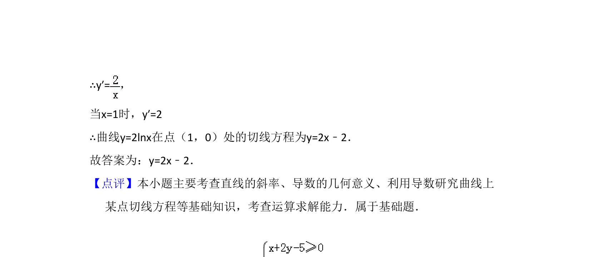

## 题面

## 摘要

求曲线y=2lnx在点(1,0)处的切线方程，利用导数求斜率。

## 关联考点

- [[440-导数的几何意义|导数的几何意义]]
- [[422-切线方程|切线方程]]
- [[828-对数函数求导|对数函数求导]]

## 答案与解析

> 📄 原 PDF 第 9 页：`素材/真题/吉林/2008-2024·（吉林）数学高考真题/2018年高考数学试卷（文）（新课标Ⅱ）（解析卷）.pdf`

<!-- 题干文本-start -->
## 题干文本
13．（5分）曲线y=2lnx在点（1，0）处的切线方程为　y=2x﹣2　．
<!-- 题干文本-end -->

<!-- 解析文本-start -->
## 解析文本
【考点】6H：利用导数研究曲线上某点切线方程．菁优网版权所有
【专题】11：计算题；34：方程思想；49：综合法；53：导数的综合应用．
【分析】欲求出切线方程，只须求出其斜率即可，故先利用导数求出在x=1的导
函数值，再结合导数的几何意义即可求出切线的斜率．从而问题解决．
【解答】解：∵y=2lnx，
<!-- 解析文本-end -->
